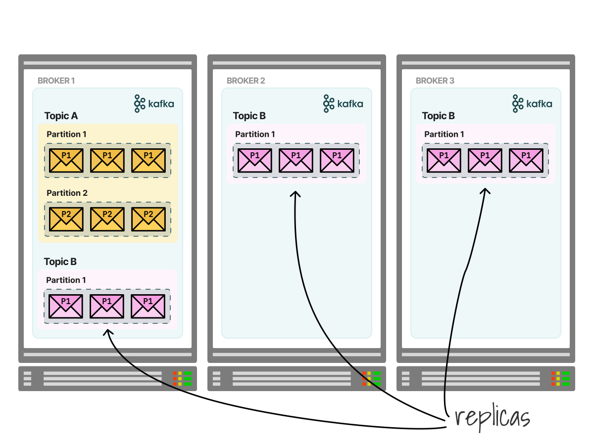
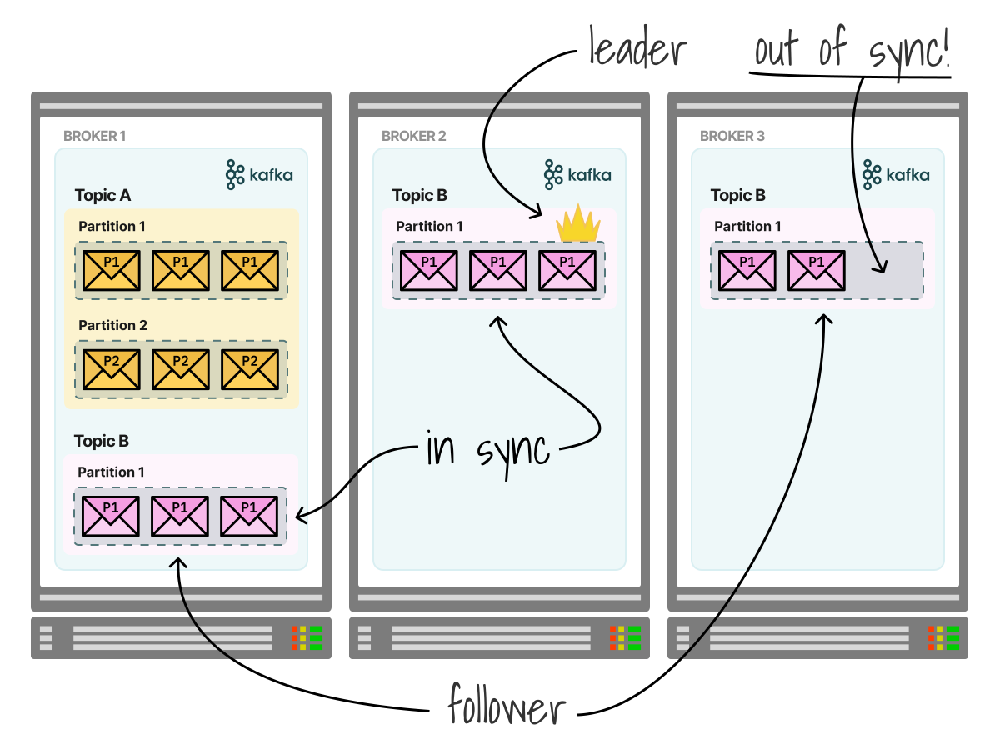

Designing and testing a highly available Kafka cluster on Kubernetes
====================================================================

April 2022 [Original Artical](https://learnk8s.io/kafka-ha-kubernetes)

* * *


* * *

_TL;DR: In this article, you'll look at Kafka's architecture and how it supports high availability with replicated partitions. Then, you will design a Kafka cluster to achieve high availability using standard Kubernetes resources and see how it tolerates node maintenance and total node failure._

In its simplest form, the architecture of Kafka consists of a single Broker server and its Producers and Consumers as clients.

* 1/2 **Producers create records and publish them to the Kafka broker.**

    
* 2/2 **A consumer consumes records from the broker.**


Although this Kafka cluster can support typical Kafka use cases, it is too simplistic for most practical cases.

Kafka is typically run as a cluster of three or more brokers that can span multiple data centers or cloud regions.


This cluster architecture supports the need for scalability, consistency, availability, partition tolerance and performance.

Like any engineering endeavour, there are trade-offs to be made between these qualities.

In this article, your learning goals are to explore the _availability_ of Kafka on Kubernetes.

In particular, we will design a Kafka cluster that:

1.  Prefers **availability over consistency**, which is [a trade-off you may want to make](https://en.wikipedia.org/wiki/CAP_theorem) for a use case such as real-time metrics collection, where, in case of failure, availability to write new data is more important than losing some historical data points.
2.  Chooses **simplicity over other non-functional requirements** (e.g. security, performance, efficiency, etc.) to focus on learning Kafka and Kubernetes.
3.  Assumes that **maintenance and unplanned disruptions are more likely than infrastructure failure.**

With those goals in mind, let's first discuss a typical highly available Kafka cluster — without Kubernetes.

Table of content
----------------

*   [Kafka partitions and replication-factor](#kafka-partitions-and-replication-factor)
*   [Understanding broker outages](#understanding-broker-outages)
*   [Requirements to mitigate common failures](#requirements-to-mitigate-common-failures)
*   [Deploying a 3-node Kafka cluster on Kubernetes](#deploying-a-3-node-kafka-cluster-on-kubernetes)
*   [The Kafka StatefulSet](#the-kafka-statefulset)
*   [Combining a StatefulSet with a Headless Service](#combining-a-statefulset-with-a-headless-service)
*   [Producing an event](#producing-an-event)
*   [Consume the events on the "test" topic](#consume-the-events-on-the-test-topic)
*   [Surviving a node down for maintenance: drain the node hosting the leader](#surviving-a-node-down-for-maintenance-drain-the-node-hosting-the-leader)
*   [Do producers and consumers still work?](#do-producers-and-consumers-still-work-)
*   [A Kafka pod is Pending](#a-kafka-pod-is-pending)
*   [Pod Topology Constraints help you spread the pods across failure domains](#pod-topology-constraints-help-you-spread-the-pods-across-failure-domains)
*   [Should you use Pod Topology Constraints or Node Affinity?](#should-you-use-pod-topology-constraints-or-node-affinity-)
*   [Return to full strength](#return-to-full-strength)
*   [Surviving multiple nodes down for maintenance](#surviving-multiple-nodes-down-for-maintenance)
*   [Pod Disruption Budget](#pod-disruption-budget)
*   [Breaking badly: the node ain't coming back!](#breaking-badly-the-node-ain-t-coming-back-)
*   [Kafka-2 is dead. Long live its successor, kafka-2.](#kafka-2-is-dead-long-live-its-successor-kafka-2-)
*   [Is the replacement broker in sync?](#is-the-replacement-broker-in-sync-)
*   [Summary](#summary)

Kafka partitions and replication-factor
---------------------------------------

In Kafka, messages are categorized into topics, and each topic has a name that is unique across the entire cluster.

For example, if you build a chat app, you might have a topic for each room (e.g. "dave-tom-chat").

_But what happens when the number of messages outgrows the size of the broker?_

**Topics are broken down into partitions, each of which can live on a separate node in the Kafka cluster.**

In other words, all messages from a single topic could be stored in different brokers, but all the messages from a single partition can only be found on the same node.

* 1/3 **If a topic contains all messages, how does it work when there is no space on the device?**

    
* 2/3 **Kafka uses partitions to distribute records to multiple brokers.**  
    
* 3/3 **Each topic can have a different number of partitions. All the records from a single partition are always stored together on the node.**


This design choice enables parallelization of topics, scalability and high message throughput.

_But there's more._

**Topics are configured with a replication factor, which determines the number of copies for each partition.**

If a cluster has a single topic with one partition, a replication factor of three means that there are three partitions: one copy for each partition.



All replicas of a partition exist on separate brokers, so you cannot have more partition copies than nodes in the cluster.

In the previous example, with a replication factor of three, you should expect at least three nodes in your Kafka cluster.

_But how does Kafka keep those copies in sync?_

**Partitions are organized into leaders and followers, where the partition leader handles all writes and reads, and followers are purely for failover.**

A follower can either be in-sync with the leader (containing all the partition leader's messages, except for messages within a small buffer window) or out of sync.



**The set of all in-sync replicas is referred to as the ISR (in-sync replicas).**

Those are the basics of Kafka and replication; let's see what happens when it breaks.

Understanding broker outages
----------------------------

Let's imagine the Kafka cluster has three brokers and a replication factor of 1.

There's a single topic in the cluster with a single partition.

**When the broker becomes unavailable, the partition is unavailable too, and the cluster can't serve consumers or producers.**


Let's change this by setting the replication factor to 3.

In this scenario, each broker has a copy of a partition.

_What happens when a broker is made unavailable?_


If the partition has additional in-sync replicas, one of those will become the interim partition leader.

The cluster can operate as usual, and there's no downtime for consumers or producers.

* 1/2 **A Kafka cluster with all partitions in sync loses a broker.** 
    
* 2/2 **One of the two partitions will be promoted as the leader, and the cluster will keep operating as usual.**


_What about when there are partition copies, but they are not in sync?_

In this case, there are two options:

1.  Either we choose to wait for the partition leader to come back online–sacrificing availability or
2.  Allow an out-of-sync replica to become the interim partition leader–sacrificing consistency.

* 1/3 **A Kafka cluster with partitions not in sync loses a broker.**

    
*2/3 **The cluster can promote one of the out of sync replicas to be the leader. However, you might miss some records.**

    
* 3/3 **Alternatively, you can wait for the broker to return and thus compromise your availability to dispatch events.**


Now that we've discussed a few failure scenarios let's see how you could mitigate them.

Requirements to mitigate common failures
----------------------------------------

You probably noticed that a partition should have an extra in-sync replica (ISR) available to survive the loss of the partition leader.

So a naive cluster size could have two brokers with a minimum in-sync replica size of 2.

_However, that's not enough._

If you only have two replicas and then lose a broker, the in-sync replica size decreases to 1 and neither the producer nor consumer can work (i.e. minimum in-sync replica is 2).

**Therefore, the number of brokers should be greater than the minimum in-sync replica size (i.e. at least 3).**

* 1/4 **You could set up a Kafka cluster with only two brokers and a minimum in-sync replica size of 2.**

    
* 2/4 **However, when a broker is lost, the cluster becomes unavailable because a single replica is in sync.**

    
* 3/4 **You should provision a Kafka cluster that has one broker more than the size of the in-sync replica.**

    
* 4/4 **In this case, the Kafka cluster can still carry on if one broker is lost.**
    

_But where should you place those broker nodes?_

Considering that you will have to host the Kafka cluster, it's good to spread brokers among [failure-domains such as regions, zones, nodes, etc.](https://en.wikipedia.org/wiki/Failure_domain)

So, if you wish to design a Kafka cluster that can tolerate one planned and one unplanned failure, you should consider the following requirements:

1.  A minimum in-sync replicas of 2.
2.  A replication factor of 3 for topics.
3.  At least 3 Kafka brokers, each running on different nodes.
4.  Nodes spread across three availability zones.

In the remaining part of the article, you will build and break a Kafka cluster on Kubernetes to validate those assumptions.

Deploying a 3-node Kafka cluster on Kubernetes
----------------------------------------------

Let's create a three-node cluster that spans three availability zones with:

```bash

k3d cluster create kube-cluster \
  --agents 3 \
  --k3s-node-label topology.kubernetes.io/zone=zone-a@agent:0 \
  --k3s-node-label topology.kubernetes.io/zone=zone-b@agent:1 \
  --k3s-node-label topology.kubernetes.io/zone=zone-c@agent:2
```

You can verify that the cluster is ready with:

```bash

kubectl get nodes
```

Next, let's deploy a Kafka cluster as a Kubernetes StatefulSet.

Here's a YAML manifest, `kafka.yaml`, defining the resources required to create a simple Kafka cluster:

```yaml

apiVersion: v1
kind: Service
metadata:
  name: kafka-svc
  labels:
    app: kafka-app
spec:
  clusterIP: None
  ports:
    - name: '9092'
      port: 9092
      protocol: TCP
      targetPort: 9092
  selector:
    app: kafka-app
---
apiVersion: apps/v1
kind: StatefulSet
metadata:
  name: kafka
  labels:
    app: kafka-app
spec:
  serviceName: kafka-svc
  replicas: 3
  selector:
    matchLabels:
      app: kafka-app
  template:
    metadata:
      labels:
        app: kafka-app
    spec:
      containers:
        - name: kafka-container
          image: doughgle/kafka-kraft
          ports:
            - containerPort: 9092
            - containerPort: 9093
          env:
            - name: REPLICAS
              value: '3'
            - name: SERVICE
              value: kafka-svc
            - name: NAMESPACE
              value: default
            - name: SHARE_DIR
              value: /mnt/kafka
            - name: CLUSTER_ID
              value: oh-sxaDRTcyAr6pFRbXyzA
            - name: DEFAULT_REPLICATION_FACTOR
              value: '3'
            - name: DEFAULT_MIN_INSYNC_REPLICAS
              value: '2'
          volumeMounts:
            - name: data
              mountPath: /mnt/kafka
  volumeClaimTemplates:
    - metadata:
        name: data
      spec:
        accessModes:
          - "ReadWriteOnce"
        resources:
          requests:
            storage: "1Gi"
```

You can apply all the resources in this YAML file with:

```bash

kubectl apply -f kafka.yaml
```

Inspect the resources created with:

```bash

kubectl get -f kafka.yaml
```

There is a StatefulSet with three ready Kafka broker pods and a service.

There are also three independent PersistentVolumeClaims for storing Kafka data, one for each broker:

```bash

kubectl get pvc,pv
```

_What are all of those resources?_

Let's examine some of the highlights of the configuration in the `kafka.yaml` manifest.

There are two resources defined:

1.  A StatefulSet.
2.  A Headless service.

The Kafka StatefulSet
---------------------

A StatefulSet is an object designed to create pod replicas — just like a Deployment.

But unlike a Deployment, a StatefulSet provides guarantees about the ordering and uniqueness of these Pods.

**Each Pod in a StatefulSet derives its hostname from the name of the StatefulSet and the ordinal of the Pod.**

The pattern is `$(statefulset name)-$(ordinal)`.

In your case, the name of the StatefulSets is `kafka`, so you should expect three pods with `kafka-0`, `kafka-1`, `kafka-2`.


Let's verify that with:

```bash

kubectl get pods
```

_What happens when you delete `kafka-0`?_

_Does Kubernetes spawn `kafka-3`?_

Let's test it with:

```bash

kubectl delete pod kafka-0
```

List the running pods with:

```bash

kubectl get pods
```

Kubernetes recreated the Pod with the same name!

Let's inspect the rest of the StatefulSet YAML definition.

```yaml

apiVersion: apps/v1
kind: StatefulSet
metadata:
  name: kafka
  labels:
    app: kafka-app
spec:
  serviceName: kafka-svc
  replicas: 3
  selector:
    matchLabels:
      app: kafka-app
  template:
    metadata:
      labels:
        app: kafka-app
    spec:
      containers:
        - name: kafka-container
          image: doughgle/kafka-kraft
          ports:
            - containerPort: 9092
            - containerPort: 9093
          env:
            - name: REPLICAS
              value: '3'
            - name: SERVICE
              value: kafka-svc
            - name: NAMESPACE
              value: default
            - name: SHARE_DIR
              value: /mnt/kafka
            - name: CLUSTER_ID
              value: oh-sxaDRTcyAr6pFRbXyzA
            - name: DEFAULT_REPLICATION_FACTOR
              value: '3'
            - name: DEFAULT_MIN_INSYNC_REPLICAS
              value: '2'
          volumeMounts:
            - name: data
              mountPath: /mnt/kafka
```

The StatefulSet defines three replicas so that three pods will be created from the pod spec template.

There's a container image that, when it starts, it:

1.  Configures the broker's `server.properties` with its unique broker id, internal and external listeners, and quorum voters list.
2.  Formats the log directory.
3.  Starts the Kafka Java process.

> If you are interested in the details of those actions, you can find the script in this repository.

The container image exposes two ports:

*   `9092` for client communication. That is necessary for producers and consumers to connect.
*   `9093` for internal, inter-broker communication.

In the next part of the YAML, there is a long list of environment variables:

```yaml

apiVersion: apps/v1
kind: StatefulSet
metadata:
  name: kafka
  labels:
    app: kafka-app
spec:
  serviceName: kafka-svc
  replicas: 3
  selector:
    matchLabels:
      app: kafka-app
  template:
    metadata:
      labels:
        app: kafka-app
    spec:
      containers:
        - name: kafka-container
          image: doughgle/kafka-kraft
          ports:
            - containerPort: 9092
            - containerPort: 9093
          env:
            - name: REPLICAS
              value: '3'
            - name: SERVICE
              value: kafka-svc
            - name: NAMESPACE
              value: default
            - name: SHARE_DIR
              value: /mnt/kafka
            - name: CLUSTER_ID
              value: oh-sxaDRTcyAr6pFRbXyzA
            - name: DEFAULT_REPLICATION_FACTOR
              value: '3'
            - name: DEFAULT_MIN_INSYNC_REPLICAS
              value: '2'
          volumeMounts:
            - name: data
              mountPath: /mnt/kafka
```

Those are used in the entry point script to derive values for broker settings in [`server.properties`](https://docs.confluent.io/platform/current/installation/configuration/broker-configs.html):

*   `REPLICAS` - used as an iterator boundary to set the [`controller.quorum.voters`](https://kafka.apache.org/documentation/#brokerconfigs_controller.quorum.voters) property to a list of brokers.
*   `SERVICE` and `NAMESPACE` - used to derive the CoreDNS name for each broker in the cluster for setting [`controller.quorum.voters`](https://kafka.apache.org/documentation/#brokerconfigs_controller.quorum.voters), [`listeners`](https://kafka.apache.org/documentation/#connectconfigs_listeners) and [`advertised.listeners`](https://kafka.apache.org/documentation/#brokerconfigs_advertised.listeners).
*   `SHARE_DIR` - used to set [`log.dirs`](https://kafka.apache.org/documentation/#brokerconfigs_log.dirs); The directories in which the Kafka data is stored.
*   `CLUSTER_ID` is the unique identifier for the Kafka cluster.
*   `DEFAULT_REPLICATION_FACTOR` is the cluster-wide default replication factor.
*   `DEFAULT_MIN_INSYNC_REPLICAS` is the cluster-wise default in-sync replicas size.

In the rest of the YAML, there's the definition for a PersitentVolumeClaim template and the `volumeMounts`:

```yaml

apiVersion: apps/v1
kind: StatefulSet
metadata:
  name: kafka
  labels:
    app: kafka-app
spec:
  serviceName: kafka-svc
  replicas: 3
  selector:
    matchLabels:
      app: kafka-app
  template:
    metadata:
      labels:
        app: kafka-app
    spec:
      containers:
        - name: kafka-container
          image: doughgle/kafka-kraft
          ports:
            - containerPort: 9092
            - containerPort: 9093
          env:
            # truncated output
          volumeMounts:
            - name: data
              mountPath: /mnt/kafka
  volumeClaimTemplates:
    - metadata:
        name: data
      spec:
        accessModes:
          - "ReadWriteOnce"
        resources:
          requests:
            storage: "1Gi"
```

For each pod, the StatefulSet creates a PersistentVolumeClaim using the details in the `volumeClaimTemplates`.


In this case, it creates a PersistentVolumeClaim with:

*   `ReadWriteOnce` access mode to enforce the constraint that the volume should only belong to one node at a time.
*   `1Gi` of storage.

The PersistentVolumeClaim is then bound to the underlying storage via a PersistentVolume.

The claim is mounted as a volume in the container at `/mnt/kafka`.

This is where the Kafka broker stores data in files organised by topic and partition.

**It's important to notice that the StatefulSet guarantees that a given Pod will always map to the same storage identity.**

If the pod `kafka-0` is deleted, Kubernetes will recreate one with the same name and mount the same PersistentVolumeClaim and PersistentVolume.

_Keep this in mind as it will become useful later._

Combining a StatefulSet with a Headless Service
-----------------------------------------------

At the beginning of the YAML definition for your Kafka cluster, there is a Service definition:

```yaml

apiVersion: v1
kind: Service
metadata:
  name: kafka-svc
  labels:
    app: kafka-app
spec:
  clusterIP: None
  ports:
    - name: '9092'
      port: 9092
      protocol: TCP
      targetPort: 9092
  selector:
    app: kafka-app
```

A Service with `clusterIP: None` is usually called a Headless Service.

[But Kubernetes has four types of services:](https://kubernetes.io/docs/concepts/services-networking/service/)

1.  ClusterIP.
2.  NodePort.
3.  LoadBalancer.
4.  External.

_So, what's a Headless Service?_

A Headless Service is a variation of the ClusterIP service with no IP address.

_So, how do you use it?_

A headless service is helpful in combination with CoreDNS.

When you issue a DNS query to a standard ClusterIP service, you receive a single IP address:

```bash

dig standard-cluster-ip.default.svc.cluster.local
```

However, when you query a Headless service, the DNS replies with all of the individual IP addresses of the Pods (in this case, the service has two pods):

```bash

dig headless.default.svc.cluster.local
```

You should have two Pods Running and one Pending:

```bash

    kubectl get pod -l app=kafka-app
    NAME      READY   STATUS    RESTARTS
    kafka-1   1/1     Running   1
    kafka-0   1/1     Running   0
    kafka-2   0/1     Pending   0
```

If an eviction event exceeds the pod disruption budget, the disruption will be prevented.

Let's test that by draining the node again:

```bash

    kubectl drain k3d-kube-cluster-agent-0 \
      --delete-emptydir-data \
      --force \
      --ignore-daemonsets
    node/k3d-kube-cluster-agent-0 cordoned
    evicting pod default/kafka-0
    error when evicting pods/"kafka-0" -n "default" (will retry after 5s):
    Cannot evict pod as it would violate the pod's disruption budget.
```

Despite the error, notice that the node is still cordoned to prevent kubernetes scheduling new pods on it:

```bash

    kubectl get nodes
    NAME                        STATUS                      ROLES                  VERSION
    k3d-kube-cluster-server-0   Ready                       control-plane,master   v1.22.7+k3s1
    k3d-kube-cluster-agent-1    Ready,SchedulingDisabled    <none>                 v1.22.7+k3s1
    k3d-kube-cluster-agent-0    Ready,SchedulingDisabled    <none>                 v1.22.7+k3s1
    k3d-kube-cluster-agent-2    Ready                       <none>                 v1.22.7+k3s1
```

But the Kafka pod is still running:

```bash

    kubectl get pods -o wide
    NAME      READY   STATUS    IP           NODE
    kafka-1   1/1     Running   10.42.0.15   k3d-kube-cluster-agent-0
    kafka-0   1/1     Running   10.42.0.13   k3d-kube-cluster-agent-2
    kafka-2   1/1     Pending   <none>       <none>
```

Also, pods not constrained by the PodDisruptionBudget will still be evicted and rescheduled.


_The node `k3d-kube-cluster-agent-1` is still unavailable; what if it doesn't come back?_

Breaking badly: the node ain't coming back!
-------------------------------------------

If all partitions are replicated with two in-sync replicas, no data should be lost if a Kubernetes node is removed permanently.

However, the broker pod will never be rescheduled due to the node affinity constraint on its persistent volume.

_Let's explore what happens._

You can remove a node completely with:

```bash
    kubectl delete node k3d-kube-cluster-agent-1
    node "k3d-kube-cluster-agent-1" deleted
```

In this case, `kafka-2` is pending because `k3d-kube-cluster-agent-1` has gone, and along with it, kafka-2's local data volume.

```bash
    kubectl get pods kafka-1 -o wide
    NAME      READY   STATUS    RESTARTS
    kafka-2   0/1     Pending   0
```

It can't be rescheduled onto another node because no other node can satisfy the nodeAffinity constraint on the Volume.

_Do producers and consumers still work?_

_Can the cluster live with this?_

With two brokers running, you should expect Kafka to be available for producers and consumers.


Let's make a quick sanity check.

Since most of the broker IP addresses have been rotated, let's retrieve them with:

```bash

    kubectl describe service kafka-svc
    Name:              kafka-svc
    Namespace:         default
    Labels:            app=kafka-app
    Selector:          app=kafka-app
    Type:              ClusterIP
    Port:              9092  9092/TCP
    TargetPort:        9092/TCP
    Endpoints:         10.42.0.15:9092,10.42.0.13:9092
```

Produce another message, "Hello World. Do you copy?":

```bash
bash@kafka-client

    kafka-console-producer.sh \
      --topic test \
      --request-required-acks all \
      --bootstrap-server 10.42.0.15:9092,10.42.0.13:9092
    >Hello World. Do you copy?
```

The message seems to be committed.

How about consuming the messages, both new and historical ones?

```bash

bash@kafka-client

    kafka-console-consumer.sh \
      --topic test \
      --from-beginning \
      --bootstrap-server 10.42.0.15:9092,10.42.0.13:9092
    hello world
    hello again, world
    Hello World. Do you copy?
```

_Excellent!_

All messages were retrieved!

Let's also examine the "test" topic with:

```bash
bash@kafka-client

    kafka-topics.sh --describe \
      --topic test \
      --bootstrap-server 10.42.0.15:9092,10.42.0.13:9092
    Topic: test
    TopicId: QqrcLtJSRoufzOZqNc9KcQ
    PartitionCount: 1
    ReplicationFactor: 3
    Configs: min.insync.replicas=2,segment.bytes=1073741824
    
    Topic: test
    Partition: 0
    Leader: 1
    Replicas: 1,2,0
    Isr: 1,2
```

So, producers and consumers are still available, but can we live with only two broker nodes in your Kafka cluster?

_No, not really._

**The current state prohibits any voluntary maintenance.**

Like this `drain` operation, for example:

```bash

    kubectl drain k3d-kube-cluster-agent-2 --ignore-daemonsets
    node/k3d-kube-cluster-agent-2 cordoned
    evicting pod default/kafka-0
    error when evicting pods/"kafka-0" -n "default" (will retry after 5s):
    Cannot evict pod as it would violate the pod's disruption budget.
```

_So, how might we recover from this scenario?_

Kafka-2 is dead. Long live its successor, kafka-2.
--------------------------------------------------

You can add a new Kubernetes worker in the same zone (zone-a) from which `k3d-kube-cluster-agent-1` departed.

In this tutorial, using k3d, adding a new node looks like this:

```bash

    k3d node create kube-cluster-new-agent \
      --cluster kube-cluster \
      --k3s-node-label topology.kubernetes.io/zone=zone-b
    INFO[0000] Adding 1 node(s) to the runtime local cluster 'kube-cluster'...
    INFO[0000] Starting Node 'k3d-kube-cluster-new-agent-4'
    INFO[0008] Successfully created 1 node(s)!
```

You can use `kubectl get nodes` to see it joined the cluster:

```bash

    kubectl get nodes
    NAME                           STATUS     VERSION
    k3d-kube-cluster-new-agent-4   Ready      v1.21.5+k3s2
    # truncated output
```

Yup, there it is — joined and Ready.

You can clean up the old broker by deleting the PVC:

```bash

    kubectl delete pvc data-kafka-2
    persistentvolumeclaim "data-kafka-0" deleted
```

When we delete the `kafka-2` pod, kubernetes can reschedule it to a new node.

```bash

    kubectl delete po kafka-2
    pod "kafka-2" deleted
```

You can observe the new Kafka broker pod bootstrap as it happens:

```bash

    kubectl get pods --watch
    NAME              READY   STATUS              RESTARTS   AGE
    kafka-0           1/1     Running             1          4d23h
    kafka-1           1/1     Running             8          14d
    kafka-2           0/1     ContainerCreating   0          14s
    kafka-2           1/1     Running             0          51s
```

If you examine the status, you will notice that all Kafka brokers are running, and a new PersistentVolumeClaim and PersistentVolume is created:

```bash

    kubectl get pods,pvc,pv
    NAME                  READY   STATUS
    pod/kafka-2           1/1     Running
    pod/kafka-1           1/1     Running
    pod/kafka-0           1/1     Running
    
    NAME                                 STATUS   VOLUME         CAPACITY   ACCESS MODES
    persistentvolumeclaim/data-kafka-1   Bound    pvc-018e8d78   1Gi        RWO
    persistentvolumeclaim/data-kafka-2   Bound    pvc-455a7f5b   1Gi        RWO
    persistentvolumeclaim/data-kafka-0   Bound    pvc-abd6b6cf   1Gi        RWO
    
    NAME                            CAPACITY   ACCESS MODES   RECLAIM POLICY   STATUS     CLAIM
    persistentvolume/pvc-018e8d78   1Gi        RWO            Delete           Bound      default/data-kafka-1
    persistentvolume/pvc-455a7f5b   1Gi        RWO            Delete           Bound      default/data-kafka-2
    persistentvolume/pvc-fe291ef2   1Gi        RWO            Delete           Released   default/data-kafka-0
    persistentvolume/pvc-abd6b6cf   1Gi        RWO            Delete           Bound      default/data-kafka-0
```

Is the replacement broker in sync?
----------------------------------

With the test topic partitions replicated three times, you should expect `kafka-0` to sync with the other brokers eventually.

Retrieve the new endpoints with:

```bash

    kubectl describe service kafka-svc
    Name:              kafka-svc
    Namespace:         default
    Labels:            app=kafka-app
    Selector:          app=kafka-app
    Type:              ClusterIP
    Port:              9092  9092/TCP
    TargetPort:        9092/TCP
    Endpoints:         10.42.0.15:9092,10.42.0.13:9092,10.42.1.16:9092
```

Let's query the test topic and inspect the status:

```bash

bash@kafka-client

    kafka-topics.sh --describe \
      --topic test \
      --bootstrap-server 10.42.0.15:9092,10.42.0.13:9092,10.42.1.16:9092
    Topic: test
    TopicId: QqrcLtJSRoufzOZqNc9KcQ
    PartitionCount: 1
    ReplicationFactor: 3
    Configs: min.insync.replicas=2,segment.bytes=1073741824
    
    Topic: test
    Partition: 0
    Leader: 2
    Replicas: 1,2,0
    Isr: 2,0,1
```

Yep, the test topic has "2,0,1" as in-sync replicas, meaning all brokers are in sync for the test topic.

Let's consume the messages from the new broker to validate that.

First, let's get the pod IP address of `kafka-0`, our newest broker.

```bash

    kubectl get pod kafka-0 -o jsonpath='{.status.podIP}'
    10.42.0.13
```

Second, let's run the console consumer from the Kafka client pod, specifying only `kafka-0`'s pod IP address:

```bash

    kafka-console-consumer.sh \
      --topic test \
      --from-beginning \
      --bootstrap-server 10.42.0.13:9092
    hello world
    hello again, world
    Hello World. Do you copy?
```

_Great!_

**It's in sync!**

Let's recap.

Summary
-------

In this article, you designed and tested a Kafka cluster for high availability so that producers and consumers can continue to flow during a failure.

*   We acknowledged that **100% availability is not possible and that maintenance and accidental disruption are more likely than infrastructure failure.**
*   Kubernetes lost a node and its persistent volume.
*   Kafka eventually recovered, without data loss, and without blocking producers and consumers.
*   Kafka can leverage local storage for its data because it looks after topic partitions and replicas.

You also learned how you could leverage Kubernetes features to make your Kafka cluster highly available:

*   **You used pod topology constraints to spread your nodes across nodes and availability zones.**
*   You learn how the local path provisioner creates persistent volumes with nodeAffinity.
*   **You defined pod disruptions budgets to prevent administration events that could cause unplanned downtime.**