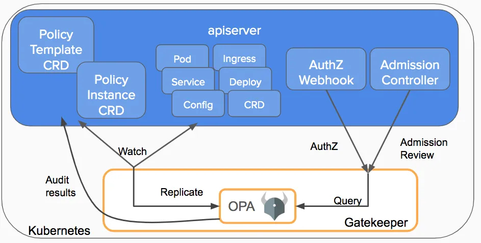
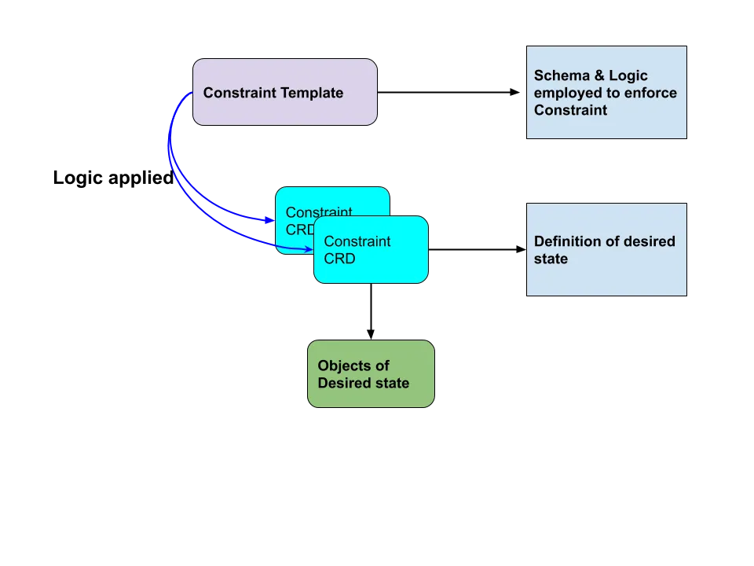

What is OPA:
------------


The [Open Policy Agent (OPA)](https://www.openpolicyagent.org/docs/latest/) is an open-source, general-purpose policy engine that unifies policy enforcement across the stack. OPA provides a high-level declarative language that lets us specify policies as code and simple APIs to offload policy decision-making from our software. We can use OPA to enforce policies in microservices, Kubernetes, CI/CD pipelines, API gateways, and more. **In kubernetes, OPA uses admission controllers.**

What is OPA Gatekeeper?
-----------------------

[OPA Gatekeeper](https://open-policy-agent.github.io/gatekeeper) is a specialized project providing first-class integration between OPA and Kubernetes.

OPA Gatekeeper adds the following on top of plain OPA:

- An extensible, parameterized policy library.  
- Native Kubernetes CRDs for instantiating the policy library (aka “**_constraints_**”).  
- Native Kubernetes CRDs for extending the policy library (aka “**_constraint templates_**”).  
- Audit functionality.



From: [Kubernetes Blog](https://kubernetes.io/blog/2019/08/06/opa-gatekeeper-policy-and-governance-for-kubernetes/)

Gatekeeper Installation:
------------------------

```bash
kubectl apply -f https://raw.githubusercontent.com/open-policy-agent/gatekeeper/master/deploy/gatekeeper.yaml
```

Following are the objects created as part of the gatekeeper installation:

```bash
kubectl get all -n gatekeeper-system    
NAME                                                 READY   STATUS    RESTARTS   AGE  
pod/gatekeeper-audit-56ddcd8749-mlvjv                1/1     Running   0          2m50s  
pod/gatekeeper-controller-manager-64fd6c8cfd-cqvnw   1/1     Running   0          2m49s  
pod/gatekeeper-controller-manager-64fd6c8cfd-xgmxv   1/1     Running   0          2m49s  
pod/gatekeeper-controller-manager-64fd6c8cfd-znxfh   1/1     Running   0          2m49s  
  
NAME                                 TYPE        CLUSTER-IP     EXTERNAL-IP   PORT(S)   AGE  
service/gatekeeper-webhook-service   ClusterIP   10.245.56.27   <none>        443/TCP   2m51s  
  
NAME                                            READY   UP-TO-DATE   AVAILABLE   AGE  
deployment.apps/gatekeeper-audit                1/1     1            1           2m51s  
deployment.apps/gatekeeper-controller-manager   3/3     3            3           2m50s  
  
NAME                                                       DESIRED   CURRENT   READY   AGE  
replicaset.apps/gatekeeper-audit-56ddcd8749                1         1         1       2m51s  
replicaset.apps/gatekeeper-controller-manager-64fd6c8cfd   3         3         3       2m50s
```

Validating Admission Control
----------------------------

Once all the Gatekeeper components have been installed in our cluster, the API server will trigger the Gatekeeper admission webhook to process the admission request whenever a resource in the cluster is created, updated, or deleted.  
During the validation process, Gatekeeper acts as a bridge between the API server and OPA. The API server will enforce all policies executed by OPA.

**CustomResourceDefinition**
----------------------------

The **CustomResourceDefinition** ( [CRD](https://kubernetes.io/docs/concepts/extend-kubernetes/api-extension/custom-resources/#customresourcedefinitions) ) API allows us to define custom resources. Defining a CRD object creates a new custom resource with a name and schema that we specify. The Kubernetes API serves and handles the storage of your custom resources.

Gatekeeper uses [CustomResourceDefinitions](https://kubernetes.io/docs/tasks/extend-kubernetes/custom-resources/custom-resource-definitions/) internally and allows us to define **ConstraintTemplates** and **Constraints** to enforce policies on Kubernetes resources such as Pods, Deployments, and Jobs.

Gatekeeper creates several CRDs during the installation process :

```bash
kubectl get crd | grep -i gatekeeper  
  
assign.mutations.gatekeeper.sh                       2022-11-29T07:04:42Z  
assignmetadata.mutations.gatekeeper.sh               2022-11-29T07:04:43Z  
configs.config.gatekeeper.sh                         2022-11-29T07:04:43Z  
constraintpodstatuses.status.gatekeeper.sh           2022-11-29T07:04:43Z  
constrainttemplatepodstatuses.status.gatekeeper.sh   2022-11-29T07:04:43Z  
constrainttemplates.templates.gatekeeper.sh          2022-11-29T07:04:44Z #<---  
expansiontemplate.expansion.gatekeeper.sh            2022-11-29T07:04:44Z  
modifyset.mutations.gatekeeper.sh                    2022-11-29T07:04:44Z  
mutatorpodstatuses.status.gatekeeper.sh              2022-11-29T07:04:44Z  
providers.externaldata.gatekeeper.sh                 2022-11-29T07:04:44Z
```

One of them is “**constrainttemplates.templates.gatekeeper.sh**” using that we can create **Constraints** and **Constraint Templates** to work with gatekeeper:


From: [https://dev.to/ashokan/kubernetes-policy-management-ii-opa-gatekeeper-465g](https://dev.to/ashokan/kubernetes-policy-management-ii-opa-gatekeeper-465g)

- [**ConstraintTemplates**](https://open-policy-agent.github.io/gatekeeper/website/docs/howto) define a way to validate some set of Kubernetes objects in Gatekeeper’s Kubernetes admission controller. They are made of two main elements:

	1.  [Rego](https://www.openpolicyagent.org/docs/latest/#rego) code that defines a policy violation
	2.  The schema of the accompanying **`Constraint`** object, which represents an instantiation of a **`ConstraintTemplate`**

- A **Constraint** is a declaration of requirements that a system needs to meet. In another word, **Constraints** are used to inform Gatekeeper that the admin wants a ConstraintTemplate to be enforced, and how.


From: [https://grumpygrace.dev/posts/intro-to-gatekeeper-policies/](https://grumpygrace.dev/posts/intro-to-gatekeeper-policies/)

Following is an illustration of how CRD, Contraint Template, and Constraint connect with each other:


Walkthrough
-----------

Now let’s say we want to enforce a policy so that a kubernetes resource (such as a pod, namespace, etc) must have a particular label defined. To achieve that let’s create a **`ConstraintTemplate`** first and then create a **`Constraint`** :

ConstraintTemplate:
-------------------

Following is the **`ConstraintTemplate.yaml`** file, we will use this file to create an **`ConstraintTemplate`** on our k8s cluster:

```yaml
# ConstraintTemplate.yaml  
# ---------------------------------------------------------------  
apiVersion: templates.gatekeeper.sh/v1  
kind: ConstraintTemplate                    # Template Identifying Info  
metadata:  
  name: k8srequiredlabels  
# ----------------------------------------------------------------  
spec:  
  crd:  
    spec:  
      names:  
        kind: K8sRequiredLabels        # Template values for constraint crd's                                            
      validation:  
        # Schema for the `parameters` field  
        openAPIV3Schema:  
          type: object  
          properties:  
            labels:  
              type: array  
              items:  
                type: string  
# ----------------------------------------------------------------  
  targets:  
    - target: admission.k8s.gatekeeper.sh  
      rego: |                                     # Rego  
        package k8srequiredlabels  
  
        violation\[{"msg": msg, "details": {"missing_labels": missing}}] {  
          provided := {label | input.review.object.metadata.labels[label]}  
          required := {label | label := input.parameters.labels[_]}  
          missing := required - provided  
          count(missing) > 0  
          msg := sprintf("you must provide labels: %v", [missing])  
        }  
# ----------------------------------------------------------------
```
Create the **`ConstraintTemplate`** using the above-defined manifests :

```bash
kubectl create -f ConstraintTemplate.yaml  
```
  
#　List the available ConstraintTemplate's   

```bash
kubectl get ConstraintTemplate  
NAME                AGE  
k8srequiredlabels   29s
```

Constraint: **pod label**
-------------------------

Now, let's create a **`Constraint`** that will enforce that a pod must have a policy named “**app**” every time a pod is created. Following is the **`Constraint`** file named “**pod-must-have-app-level.yaml**”

```yaml
#pod-must-have-app-level.yaml

apiVersion: constraints.gatekeeper.sh/v1beta1  
kind: K8sRequiredLabels  
metadata:  
  name: pod-must-have-app-level  
spec:  
  match:  
    kinds:  
      - apiGroups: [""]  
        kinds: ["Pod"]     
  parameters:  
    labels: ["app"]    
```

Create the **`Constraint`** on our kubernetes cluster and list the available constraints:

```bash
kubectl create -f pod-must-have-app-level.yaml  

# List the available Constraint's
kubectl get constraints
  
NAME                      ENFORCEMENT-ACTION   TOTAL-VIOLATIONS  
pod-must-have-app-level                        13
```

Now, let's create a pod without defining the label and observe what happens:

```bash
# Create a pod without labels  
kubectl run nginx --image=nginx
```
Error from server (Forbidden): admission webhook "validation.gatekeeper.sh" denied the request: \[pod-must-have-app-level\] you must provide labels: {"app"}

As we can see in the above demonstration, a pod creation request is being denied because the required “label” is not provided while creating the pod.

Now, let’s create a pod with the “**app**” label and observe the behavoiur:

```bash
# Create a pod with label
kubectl run nginx --image=nginx --labels=app=test  
pod/nginx created
```

In the above demonstration, we can see that pod is deployed without any issues because we specified the required label while creating the pod.

**Constraint: namespace label**
-------------------------------

A **`ConstraintTemplate`** can be used by several **`Constraint`**. In the previous phase, we specified a **`Constraint`** so that a pod must have a particular label. If required we can create another **`Constraint`** using the same **`ConstraintTemplate`** but this time it will be for a namespace. We can write a **`Constraint`** so that a namespace must have a particular label.

Following is the **`Constraint`** file named **“ns-must-label-state.yaml”** for enforcing the namespaces to have a particular label called “**state**”:

```yaml
# ns-must-label-state.yaml  
  
apiVersion: constraints.gatekeeper.sh/v1beta1  
kind: K8sRequiredLabels  
metadata:  
  name: ns-must-label-state  
spec:  
  match:  
    kinds:  
      - apiGroups: [""]  
        kinds: ["Namespace"]  
  parameters:  
    labels: ["state"]
```

Let’s create **`Constraint`** using the above-defined **“ns-must-label-state.yaml” :**

```bash
kubectl create -f ns-must-label-state.yaml  

# List the available Constraint's
kubectl get constraints  
NAME                      ENFORCEMENT-ACTION   TOTAL-VIOLATIONS  
ns-must-label-state                            5  
pod-must-have-app-level                        13
```

And then create a **namespace** without defining the required label which is “**state**” in the current case:

```bash
kubectl create ns test  

Error from server (Forbidden): admission webhook "validation.gatekeeper.sh" denied the request: \[ns-must-label-state\] you must provide labels: {"state"}
```

Now, create a namespace using the required label and see what happens:

```yaml
# test-ns.yaml  

apiVersion: v1  
kind: Namespace  
metadata:  
  name: test  
  labels:  
    state: dev   #<--- 
```

```bash
kubectl create -f test-ns.yaml  
namespace/test created
```

In the above demonstration, we can see that the namespace is created without any issues because we specified the required label.

Check for Violations
--------------------

We can describe or inspect a **`Constraint`** to find out policy violations by the existing kubernetes resources:

```bash
# To describe a Constraint
kubectl describe <ConstraintTemplate>  <Constraint>
```
Let’s describe the “**ns-must-label-state**” constraint:

```bash
                  [ConstraintTemplate]  [Constraint]  
kubectl describe  k8srequiredlabels     ns-must-label-state 
# ---------------------------------------------------------------
  
Name:         ns-must-label-state  
Namespace:      
...  
...  
Status:  
  Audit Timestamp:  2022-11-30T02:32:48Z  
  By Pod:  
    Constraint UID:       846a2d86-5d00-4eba-bd6a-669cd27fc703  
    Enforced:             true  
    Id:                   gatekeeper-audit-56ddcd8749-htgk5  
    Observed Generation:  1  
    Operations:  
      audit  
      mutation-status  
      status  
    Constraint UID:       846a2d86-5d00-4eba-bd6a-669cd27fc703  
    Enforced:             true  
    Id:                   gatekeeper-controller-manager-64fd6c8cfd-jh7qr  
    Observed Generation:  1  
    Operations:  
      mutation-webhook  
      webhook  
    Constraint UID:       846a2d86-5d00-4eba-bd6a-669cd27fc703  
    Enforced:             true  
    Id:                   gatekeeper-controller-manager-64fd6c8cfd-q6ds9  
    Observed Generation:  1  
    Operations:  
      mutation-webhook  
      webhook  
    Constraint UID:       846a2d86-5d00-4eba-bd6a-669cd27fc703  
    Enforced:             true  
    Id:                   gatekeeper-controller-manager-64fd6c8cfd-rbvsz  
    Observed Generation:  1  
    Operations:  
      mutation-webhook  
      webhook  
  Total Violations:  5        #<-------------  
  Violations:  
    Enforcement Action:  deny  
    Group:                 
    Kind:                Namespace  
    Message:             you must provide labels: {"state"}  
    Name:                kube-public  
    Version:             v1  
    Enforcement Action:  deny  
    Group:                 
    Kind:                Namespace  
    Message:             you must provide labels: {"state"}  
    Name:                kube-node-lease  
    Version:             v1  
    Enforcement Action:  deny  
    Group:                 
    Kind:                Namespace  
    Message:             you must provide labels: {"state"}  
    Name:                gatekeeper-system  
    Version:             v1  
    Enforcement Action:  deny  
    Group:                 
    Kind:                Namespace  
    Message:             you must provide labels: {"state"}  
    Name:                kube-system  
    Version:             v1  
    Enforcement Action:  deny  
    Group:                 
    Kind:                Namespace  
    Message:             you must provide labels: {"state"}  
    Name:                default  
    Version:             v1  
Events:                  <none>
```

In the above illustration, we can see that there are several namespaces that violate the policy, It is because they (namespaces) were created before the **“ns-must-label-state”** constraint is created.

OPA Gatekeeper Library
----------------------

There is a community-owned library of policies for OPA gatekeeper projects.

● [OPA Gatekeeper Library](https://open-policy-agent.github.io/gatekeeper-library/website/)