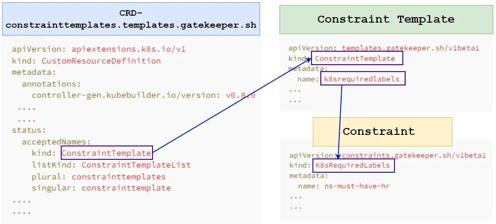

# Open Policy Agent（OPA）简介

# 什么是 OPA？
------------


[Open Policy Agent（OPA）](https://www.openpolicyagent.org/docs/latest/)是一个开源的、通用的策略引擎，它统一了整个栈中的策略执行。OPA 提供了一个高级的声明式语言，让我们能够将策略以代码的形式指定，并通过简单的 API 将策略决策从 Kubernetes 转到我们的代码来执行。我们可以使用 OPA 在微服务、Kubernetes、CI/CD 流水线、API 网关等中应用策略。**在 Kubernetes 中，OPA 使用了准入控制器。**

## 什么是 OPA Gatekeeper？
-----------------------

[OPA Gatekeeper](https://open-policy-agent.github.io/gatekeeper) 是一个专门提供 OPA 和 Kubernetes 之间集成的专用项目。

OPA Gatekeeper 在 OPA 基础上增加了以下功能：

- 一个可扩展的、参数化的策略库。
- 用于实例化策略策略库的原生 Kubernetes CRD（即“**_约束_**”）。
- 用于扩展策略库的原生 Kubernetes CRD（即“**_约束模板_**”）。
- 审计功能。


来自：[Kubernetes博客](https://kubernetes.io/blog/2019/08/06/opa-gatekeeper-policy-and-governance-for-kubernetes/)

## Gatekeeper 安装：
------------------------

```bash
kubectl apply -f https://raw.githubusercontent.com/open-policy-agent/gatekeeper/master/deploy/gatekeeper.yaml

namespace/gatekeeper-system created
resourcequota/gatekeeper-critical-pods created
customresourcedefinition.apiextensions.k8s.io/assign.mutations.gatekeeper.sh created
customresourcedefinition.apiextensions.k8s.io/assignimage.mutations.gatekeeper.sh created
customresourcedefinition.apiextensions.k8s.io/assignmetadata.mutations.gatekeeper.sh created
customresourcedefinition.apiextensions.k8s.io/configs.config.gatekeeper.sh created
customresourcedefinition.apiextensions.k8s.io/constraintpodstatuses.status.gatekeeper.sh created
customresourcedefinition.apiextensions.k8s.io/constrainttemplatepodstatuses.status.gatekeeper.sh created
customresourcedefinition.apiextensions.k8s.io/constrainttemplates.templates.gatekeeper.sh created
customresourcedefinition.apiextensions.k8s.io/expansiontemplate.expansion.gatekeeper.sh created
customresourcedefinition.apiextensions.k8s.io/expansiontemplatepodstatuses.status.gatekeeper.sh created
customresourcedefinition.apiextensions.k8s.io/modifyset.mutations.gatekeeper.sh created
customresourcedefinition.apiextensions.k8s.io/mutatorpodstatuses.status.gatekeeper.sh created
customresourcedefinition.apiextensions.k8s.io/providers.externaldata.gatekeeper.sh created
customresourcedefinition.apiextensions.k8s.io/syncsets.syncset.gatekeeper.sh created
serviceaccount/gatekeeper-admin created
role.rbac.authorization.k8s.io/gatekeeper-manager-role created
clusterrole.rbac.authorization.k8s.io/gatekeeper-manager-role created
rolebinding.rbac.authorization.k8s.io/gatekeeper-manager-rolebinding created
clusterrolebinding.rbac.authorization.k8s.io/gatekeeper-manager-rolebinding created
secret/gatekeeper-webhook-server-cert created
service/gatekeeper-webhook-service created
deployment.apps/gatekeeper-audit created
deployment.apps/gatekeeper-controller-manager created
poddisruptionbudget.policy/gatekeeper-controller-manager created
mutatingwebhookconfiguration.admissionregistration.k8s.io/gatekeeper-mutating-webhook-configuration created
validatingwebhookconfiguration.admissionregistration.k8s.io/gatekeeper-validating-webhook-configuration created
```

以下是作为 gatekeeper 安装一部分创建的**对象**：

```bash
kubectl get all -n gatekeeper-system  
NAME                                                READY   STATUS    RESTARTS     AGE
pod/gatekeeper-audit-fbcc6f694-zx67r                1/1     Running   1 (6s ago)   31s
pod/gatekeeper-controller-manager-56d5f9bc7-9zg8r   1/1     Running   0            31s
pod/gatekeeper-controller-manager-56d5f9bc7-gh866   1/1     Running   0            31s
pod/gatekeeper-controller-manager-56d5f9bc7-mz8t5   1/1     Running   0            31s

NAME                                 TYPE        CLUSTER-IP      EXTERNAL-IP   PORT(S)   AGE
service/gatekeeper-webhook-service   ClusterIP   10.102.198.93           443/TCP   31s

NAME                                            READY   UP-TO-DATE   AVAILABLE   AGE
deployment.apps/gatekeeper-audit                1/1     1            1           31s
deployment.apps/gatekeeper-controller-manager   3/3     3            3           31s

NAME                                                      DESIRED   CURRENT   READY   AGE
replicaset.apps/gatekeeper-audit-fbcc6f694                1         1         1       31s
replicaset.apps/gatekeeper-controller-manager-56d5f9bc7   3         3         3       31s
```

## 验证准入控制
----------------------------

一旦所有 Gatekeeper 组件都安装在我们的集群中，API 服务器将触发 Gatekeeper 准入 webhook 来处理每当集群中的资源被创建、更新或删除时的准入请求。
在验证过程中，Gatekeeper 充当 API 服务器和 OPA 之间的桥梁。API 服务器将执行由 OPA 执行的所有策略。

## 自定义资源定义
----------------------------

自定义资源定义（[CustomResourceDefinition, CRD](https://kubernetes.io/docs/concepts/extend-kubernetes/api-extension/custom-resources/#customresourcedefinitions)）API 允许我们定义自定义资源。定义 CRD 对象会创建一个新的自定义资源，其名称和模式由我们指定。Kubernetes API 服务并处理存储您的自定义资源。

Gatekeeper 在内部使用[自定义资源定义](https://kubernetes.io/docs/tasks/extend-kubernetes/custom-resources/custom-resource-definitions/)，并允许我们定义 ConstraintTemplates 和 Constraints 来在 Kubernetes 资源（如 Pods、Deployments 和 Jobs）上应用策略。

Gatekeeper 在安装过程中创建了如下几个 CRD：

```bash
kubectl get crd | grep -i gatekeeper

assign.mutations.gatekeeper.sh                       2024-09-22T13:05:29Z
assignimage.mutations.gatekeeper.sh                  2024-09-22T13:05:29Z
assignmetadata.mutations.gatekeeper.sh               2024-09-22T13:05:29Z
configs.config.gatekeeper.sh                         2024-09-22T13:05:29Z
constraintpodstatuses.status.gatekeeper.sh           2024-09-22T13:05:29Z
constrainttemplatepodstatuses.status.gatekeeper.sh   2024-09-22T13:05:29Z
constrainttemplates.templates.gatekeeper.sh          2024-09-22T13:05:29Z
expansiontemplate.expansion.gatekeeper.sh            2024-09-22T13:05:30Z
expansiontemplatepodstatuses.status.gatekeeper.sh    2024-09-22T13:05:30Z
modifyset.mutations.gatekeeper.sh                    2024-09-22T13:05:30Z
mutatorpodstatuses.status.gatekeeper.sh              2024-09-22T13:05:30Z
providers.externaldata.gatekeeper.sh                 2024-09-22T13:05:30Z
syncsets.syncset.gatekeeper.sh                       2024-09-22T13:05:30Z
```

其中之一是“**constrainttemplates.templates.gatekeeper.sh**”，我们可以使用它来创建 Constraints 和 Constraint Templates 来与 gatekeeper 一起工作：


来自：https://dev.to/ashokan/kubernetes-policy-management-ii-opa-gatekeeper-465g

- 约束模板（[**ConstraintTemplates**](https://open-policy-agent.github.io/gatekeeper/website/docs/howto) ）定义了 Gatekeeper 的 Kubernetes 准入控制器中验证一组Kubernetes对象的方式。它们由两个主要元素组成：

  1. 定义策略违规的 [Rego](https://www.openpolicyagent.org/docs/latest/#rego) 代码；
  2. 伴随**约束（`Constraint`）**对象的模式，该对象表示约束模板的实例化

- **约束**是对系统需要满足的要求的声明。换句话说，约束用于通知 Gatekeeper 管理员希望强制执行约束模板，以及如何执行。


From: [https://grumpygrace.dev/posts/intro-to-gatekeeper-policies/](https://grumpygrace.dev/posts/intro-to-gatekeeper-policies/)

以下是CRD、Constraint Template和Constraint如何相互连接的示意图：



## 示例
-----------

现在假设我们想要实施一个策略，要求 Kubernetes 资源（如 Pod、命名空间等）必须定义一个特定的标签。为了实现这一点，我们首先创建一个 ConstraintTemplate，然后创建一个 Constraint：

### ConstraintTemplate：

以下是 **ConstraintTemplate.yaml** 文件，我们将使用此文件在 K8s 集群上创建一个 **ConstraintTemplate**：

```yaml
#ConstraintTemplate.yaml
# ---------------------------------------------------------------
apiVersion: templates.gatekeeper.sh/v1
kind: ConstraintTemplate
metadata:
  name: k8srequiredlabels
# ---------------------------------------------------------------
spec:
  crd:
    spec:
      names:
        kind: K8sRequiredLabels
      validation:
        # Schema for the `parameters` field
        openAPIV3Schema:
          type: object
          properties:
            labels:
              type: array
              items:
                type: string
# ---------------------------------------------------------------
  targets:
    - target: admission.k8s.gatekeeper.sh
      rego: |
        package k8srequiredlabels

        violation[{"msg": msg, "details": {"missing_labels": missing}}] {
          provided := {label | input.review.object.metadata.labels[label]}
          required := {label | label := input.parameters.labels[_]}
          missing := required - provided
          count(missing) > 0
          msg := sprintf("you must provide labels: %v", [missing])
        }
# ---------------------------------------------------------------
```

使用上述定义的清单创建 **ConstraintTemplate**：

```bash
kubectl create -f ConstraintTemplate.yaml
```

列出可用的 **ConstraintTemplate**：

```bash
kubectl get ConstraintTemplate
  
NAME                AGE  
k8srequiredlabels   29s
```

### 约束：Pod 标签
-------------------------

现在，让我们创建一个约束，强制 Pod 必须有一个名为“**app**”标签的策略，每次创建 Pod 时都需要。以下是名为“**pod-must-have-app-level.yaml**”的约束文件：

```yaml
pod-must-have-app-level.yaml

apiVersion: constraints.gatekeeper.sh/v1beta1
kind: K8sRequiredLabels
metadata:
  name: pod-must-have-app-level
spec:
  match:
    kinds:
      - apiGroups: [""]
        kinds: ["Pod"]   
  parameters:
    labels: ["app"]  
```

在我们的 Kubernetes 集群上创建约束，并列出可用的约束：

```bash
kubectl create -f pod-must-have-app-level.yaml
```

列出可用的约束：

```bash
kubectl get constraints

NAME                      ENFORCEMENT-ACTION   TOTAL-VIOLATIONS
pod-must-have-app-level   deny                 13
```

现在，让我们创建一个没有定义标签的 Pod，并观察会发生什么：

```bash
#创建一个没有标签的Pod
kubectl run nginx --image=nginx

Error from server (Forbidden): admission webhook "validation.gatekeeper.sh" denied the request: [pod-must-have-app-level] you must provide labels: {"app"}
```

正如我们在上述演示中看到的，由于在创建 Pod 时没有提供所需的“**app**”标签，因此 Pod 创建请求被拒绝。

现在，让我们创建一个带有“**app**”标签的 Pod 并观察行为：

```bash
#创建带有标签的Pod
kubectl run nginx --image=nginx --labels=app=test
pod/nginx created
```

在上述演示中，我们可以看到 Pod 没有任何问题地部署了，因为我们在创建 Pod 时指定了所需的标签。

### 约束：命名空间标签
-------------------------------

以下是名为“**ns-must-label-state.yaml**”的约束文件，用于强制命名空间具有一个名为“**state**”的特定标签：

```yaml
#ns-must-label-state.yaml

apiVersion: constraints.gatekeeper.sh/v1beta1
kind: K8sRequiredLabels
metadata:
  name: ns-must-label-state
spec:
  match:
    kinds:
      - apiGroups: [""]
        kinds: ["Namespace"]
  parameters:
    labels: ["state"]
```

让我们使用上述定义的“**ns-must-label-state.yaml**”创建约束：

```bash
kubectl create -f ns-must-label-state.yaml
```

列出可用的约束：

```bash
kubectl get constraints
NAME                      ENFORCEMENT-ACTION   TOTAL-VIOLATIONS
ns-must-label-state       deny                 5
pod-must-have-app-level   deny                 13
```

然后创建一个没有定义所需标签“**state**”的命名空间：

```bash
kubectl create ns test

Error from server (Forbidden): admission webhook "validation.gatekeeper.sh" denied the request: [ns-must-label-state] you must provide labels: {"state"}
```

现在，创建一个包含所需的标签的命名空间并看看会发生什么：

```yaml
#test-ns.yaml

apiVersion: v1
kind: Namespace
metadata:
  name: test
  labels:
    state: dev   #<---
```

```bash
kubectl create -f test-ns.yaml  
namespace/test created
```

在上述演示中，我们可以看到命名空间没有任何问题地创建了，因为我们指定了所需的标签。

## 检查违规
--------------------

我们可以通过描述或检查约束来找出现有 Kubernetes 资源违反策略的情况：

```bash
#描述一个约束

kubectl describe <ConstraintTemplate>  <Constraint>
```

让我们查看“**ns-must-label-state**”约束：

```bash
                  [ConstraintTemplate]  [Constraint]
kubectl describe  k8srequiredlabels     ns-must-label-state

#---------------------------------------------------------------
Name:         ns-must-label-state
Namespace:
Labels:       
Annotations:  
API Version:  constraints.gatekeeper.sh/v1beta1
Kind:         K8sRequiredLabels
Metadata:
  Creation Timestamp:  2024-09-22T13:16:40Z
  Generation:          1
  Resource Version:    13150653
  UID:                 27c0a42a-b139-4e59-8c85-9e91e92e89cd
Spec:
  Enforcement Action:  deny
  Match:
    Kinds:
      API Groups:

Parameters:
    Labels:
      state
Status:
  Audit Timestamp:  2024-09-22T13:17:58Z
  By Pod:
    Constraint UID:       27c0a42a-b139-4e59-8c85-9e91e92e89cd
    Enforced:             true
    Id:                   gatekeeper-audit-fbcc6f694-zx67r
    Observed Generation:  1
    Operations:
      audit
      mutation-status
      status
    Constraint UID:       27c0a42a-b139-4e59-8c85-9e91e92e89cd
    Enforced:             true
    Id:                   gatekeeper-controller-manager-56d5f9bc7-9zg8r
    Observed Generation:  1
    Operations:
      mutation-webhook
      webhook
    Constraint UID:       27c0a42a-b139-4e59-8c85-9e91e92e89cd
    Enforced:             true
    Id:                   gatekeeper-controller-manager-56d5f9bc7-gh866
    Observed Generation:  1
    Operations:
      mutation-webhook
      webhook
    Constraint UID:       27c0a42a-b139-4e59-8c85-9e91e92e89cd
    Enforced:             true
    Id:                   gatekeeper-controller-manager-56d5f9bc7-mz8t5
    Observed Generation:  1
    Operations:
      mutation-webhook
      webhook
  Total Violations:  12
  Violations:
    Enforcement Action:  deny
    Group:
    Kind:                Namespace
    Message:             you must provide labels: {"state"}
    Name:                spark-test
    Version:             v1
    Enforcement Action:  deny
    Group:
    Kind:                Namespace
    Message:             you must provide labels: {"state"}
    Name:                nju02
    Version:             v1
    Enforcement Action:  deny
    Group:
    Kind:                Namespace
    Message:             you must provide labels: {"state"}
    Name:                namespace3
    Version:             v1
    Enforcement Action:  deny
    Group:
    Kind:                Namespace
    Message:             you must provide labels: {"state"}
    Name:                namespace2
    Version:             v1
    Enforcement Action:  deny
    Group:
    Kind:                Namespace
    Message:             you must provide labels: {"state"}
    Name:                namespace1
    Version:             v1
    Enforcement Action:  deny
    Group:
    Kind:                Namespace
    Message:             you must provide labels: {"state"}
    Name:                kube-system
    Version:             v1
    Enforcement Action:  deny
    Group:
    Kind:                Namespace
    Message:             you must provide labels: {"state"}
    Name:                kube-public
    Version:             v1
    Enforcement Action:  deny
    Group:
    Kind:                Namespace
    Message:             you must provide labels: {"state"}
    Name:                kube-node-lease
    Version:             v1
    Enforcement Action:  deny
    Group:
    Kind:                Namespace
    Message:             you must provide labels: {"state"}
    Name:                kb-system
    Version:             v1
    Enforcement Action:  deny
    Group:
    Kind:                Namespace
    Message:             you must provide labels: {"state"}
    Name:                gatekeeper-system
    Version:             v1
    Enforcement Action:  deny
    Group:
    Kind:                Namespace
    Message:             you must provide labels: {"state"}
    Name:                demo
    Version:             v1
    Enforcement Action:  deny
    Group:
    Kind:                Namespace
    Message:             you must provide labels: {"state"}
    Name:                default
    Version:             v1
Events:                  <none>                  
```

在上述示例中，我们可以看到有多个命名空间违反了策略，这是因为这些命名空间是在创建“**ns-must-label-state**”约束之前就已经创建了。

## OPA Gatekeeper 库
----------------------

有一个社区拥有的库，用于 OPA Gatekeeper 项目的策略。

● [OPA Gatekeeper Library](https://open-policy-agent.github.io/gatekeeper-library/website/)
