Tracing the path of network traffic in Kubernetes
=================================================

January 2022 [Original Artical](https://learnk8s.io/kubernetes-network-packets)

* * *

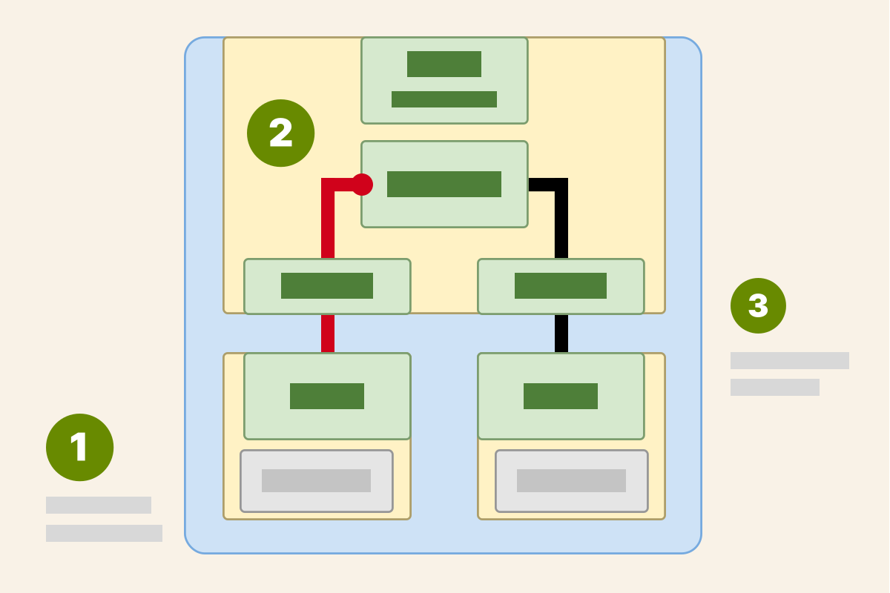

* * *

**TL;DR:** _In this article, you will learn how packets flow inside and outside a Kubernetes cluster. Starting from the initial web request and down to the container hosting the application._

Table of Contents
-----------------

*   [Table of Contents](#table-of-contents)
*   [Kubernetes networking requirements](#kubernetes-networking-requirements)
*   [How Linux network namespaces work in a pod](#how-linux-network-namespaces-work-in-a-pod)
*   [The pause container creates the network namespace in the pod](#the-pause-container-creates-the-network-namespace-in-the-pod)
*   [The pod is assigned a single IP address](#the-pod-is-assigned-a-single-ip-address)
*   [Inspecting pod to pod traffic in the cluster](#inspecting-pod-to-pod-traffic-in-the-cluster)
*   [The Pod network namespace is connected to an ethernet bridge](#the-pod-network-namespace-is-connected-to-an-ethernet-bridge)
*   [Tracing pod to pod traffic on the same node](#tracing-pod-to-pod-traffic-on-the-same-node)
*   [Tracing pod to pod communication on different nodes](#tracing-pod-to-pod-communication-on-different-nodes)
*   [The Container Network Interface - CNI](#the-container-network-interface-cni)
*   [Inspecting pod to service traffic](#inspecting-pod-to-service-traffic)
*   [Intercepting and rewriting traffic with Netfilter and Iptables](#intercepting-and-rewriting-traffic-with-netfilter-and-iptables)
*   [Inspecting responses from services](#inspecting-responses-from-services)

Kubernetes networking requirements
----------------------------------

Before diving into the details on how packets flow inside a Kubernetes cluster, let's first clear up the requirements for a Kubernetes network.

The Kubernetes networking model defines a set of fundamental rules:

*   **A pod in the cluster should be able to freely communicate with any other pod** without the use of Network Address Translation (NAT).
*   **Any program running on a cluster node should communicate with any pod** on the same node without using NAT.
*   **Each pod has its own IP address** (IP-per-Pod), and every other pod can reach it at that same address.

Those requirements don't restrict the implementation to a single solution.

Instead, they describe the properties of the cluster network in general terms.

In satisfying those constraints, you will have to solve the [following challenges:](https://github.com/kubernetes/community/blob/master/contributors/design-proposals/network/networking.md)

1.  _How do you make sure that containers in the same pod behave as if they are on the same host?_
2.  _Can the pod reach other pods in the cluster?_
3.  _Can the pod reach services? And are the services load balancing requests?_
4.  _Can the pod receive traffic external to the cluster?_

In this article, you will focus on the first three points, starting with intra-pod networking or container-to-container communication.

How Linux network namespaces work in a pod
------------------------------------------

Let's consider a main container hosting the application and another running alongside it.

In this example, you have a pod with an Nginx container and another with busybox:

```yaml
apiVersion: v1
kind: Pod
metadata:
  name: multi-container-pod
spec:
  containers:
    - name: container-1
      image: busybox
      command: ['/bin/sh', '-c', 'sleep 1d']
    - name: container-2
      image: nginx
```

When deployed, the following things happen:

1.  The pod gets **its own network namespace** on the node.
2.  **An IP address is assigned** to the pod, and the ports are shared between the two containers.
3.  **Both containers share the same networking namespace** and can see each other on localhost.

The network configuration happens lightning fast in the background.

However, let's take a step back and try to understand _why_ the above is needed for containers to run.

[In Linux, the network namespaces are separate, isolated, logical spaces.](https://iximiuz.com/en/posts/container-networking-is-simple/)

You can think of network namespaces as taking the physical network interface and slicing it into smaller independent parts.

Each part can be configured separately and with its own networking rules and resources.

Those can range from firewall rules, interfaces (virtual or physical), routes, and everything else networking-related.

*  1/2 **The physical network interface holds the root network namespace.**

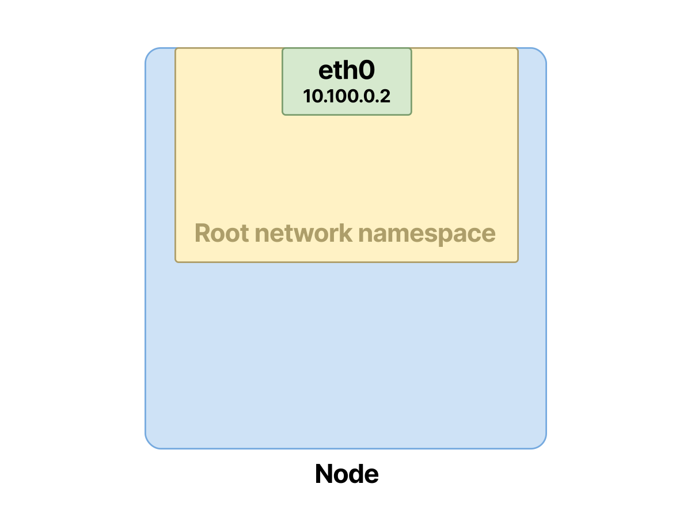
    
*  2/2 **You can use Linux network namespaces to create isolated networks. Each network is independent and doesn't talk to the others unless you configure it to.** 
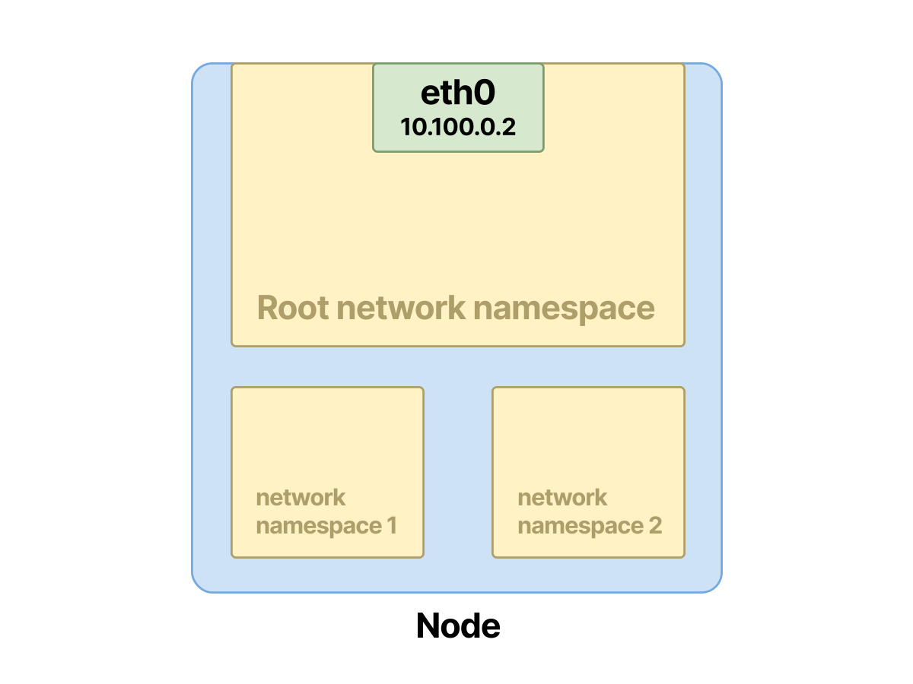
    
The physical interface has to process all the _real_ packets in the end, so all virtual interfaces are created from that.

The network namespaces can be managed by the `ip-netns` [management tool](https://man7.org/linux/man-pages/man8/ip-netns.8.html), and you can use `ip netns list` to list the namespaces on a host.

> Please note that when a network namespace is created, it will be present under `/var/run/netns` but [Docker doesn't always respect that.](https://www.packetcoders.io/how-to-view-the-network-namespaces-in-kubernetes/)

For example, these are namespaces from a Kubernetes node:

```bash
ip netns list
cni-0f226515-e28b-df13-9f16-dd79456825ac (id: 3)
cni-4e4dfaac-89a6-2034-6098-dd8b2ee51dcd (id: 4)
cni-7e94f0cc-9ee8-6a46-178a-55c73ce58f2e (id: 2)
cni-7619c818-5b66-5d45-91c1-1c516f559291 (id: 1)
cni-3004ec2c-9ac2-2928-b556-82c7fb37a4d8 (id: 0)
```

> Notice the `cni-` prefix; this means that the namespace creation has been taken care of by a CNI.

When you create a pod, and that pod gets assigned to a node, the [CNI](https://github.com/containernetworking/cni#what-is-cni) will:

1.  Assign an IP address.
2.  Attach the container(s) to the network.

If the pod contains multiple containers like above, both containers are put in the same namespace.

*  1/3 **When you create a pod, first the container runtime creates a network namespace for the containers.**
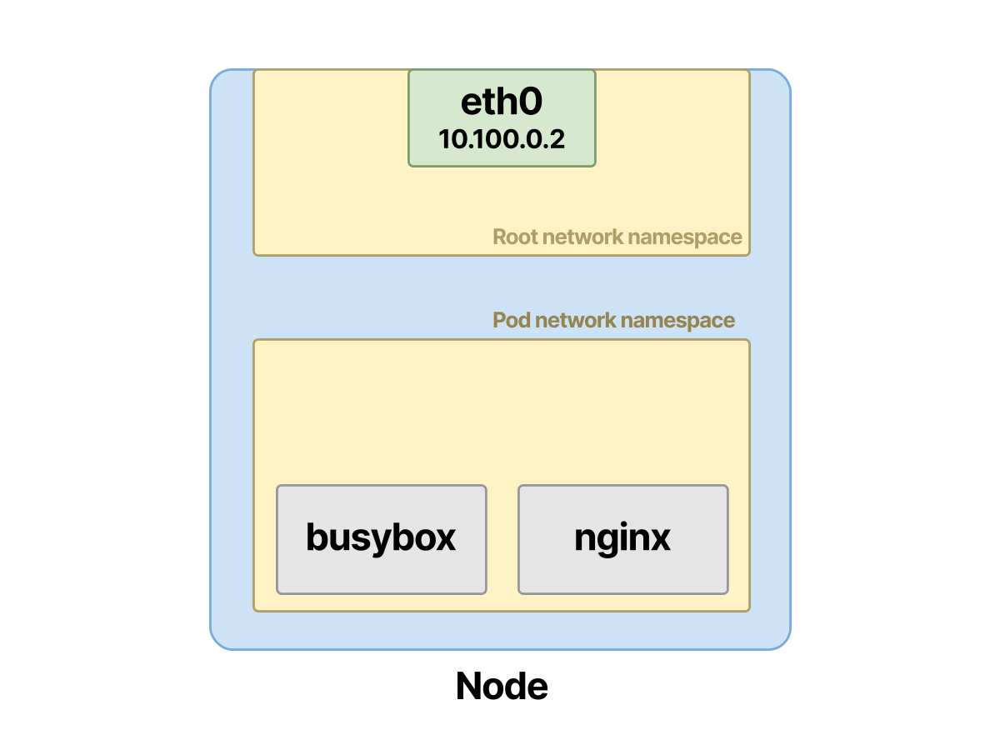
    
    
*  2/3 **Then, the CNI takes lead and assigns it an IP address.**
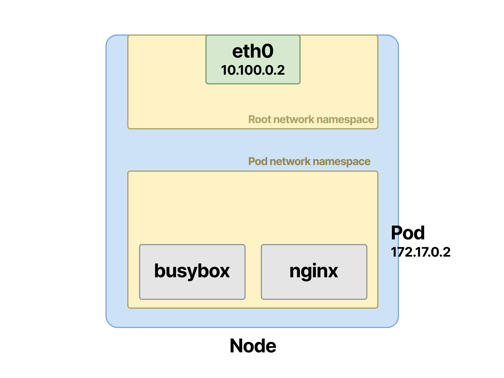
    
*  3/3 **And finally the CNI attaches the containers to the rest of the network.** 

_So what happens when you list the containers on a node?_

You can SSH into a Kubernetes node and explore the namespaces:

```bash
lsns -t net
        NS TYPE NPROCS   PID USER     NETNSID NSFS                           COMMAND
4026531992 net     171     1 root  unassigned /run/docker/netns/default      /sbin/init noembed norestore
4026532286 net       2  4808 65535          0 /run/docker/netns/56c020051c3b /pause
4026532414 net       5  5489 65535          1 /run/docker/netns/7db647b9b187 /pause
```

Where `lsns` is a command for listing _all_ available namespaces on a host.

> Keep in mind that there are [multiple namespace types](https://man7.org/linux/man-pages/man7/namespaces.7.html) in Linux.

_Where is the Nginx container?_

_What are those `pause` containers?_

The pause container creates the network namespace in the pod
------------------------------------------------------------

Let's list all the processes on the node and check if we can find the Nginx container:

```bash
lsns
        NS TYPE   NPROCS   PID USER            COMMAND
# truncated output
4026532414 net         5  5489 65535           /pause
4026532513 mnt         1  5599 root            sleep 1d
4026532514 uts         1  5599 root            sleep 1d
4026532515 pid         1  5599 root            sleep 1d
4026532516 mnt         3  5777 root            nginx: master process nginx -g daemon off;
4026532517 uts         3  5777 root            nginx: master process nginx -g daemon off;
4026532518 pid         3  5777 root            nginx: master process nginx -g daemon off;
```

The container is listed in the mount (`mnt`), Unix time-sharing (`uts`) and PID (`pid`) namespace, but not in the networking namespace (`net`).

Unfortunately, `lsns` only shows the lowest PID for each process, but you can further filter based on the process ID.

You can retrieve all namespaces for the Nginx container with:

```bash
sudo lsns -p 5777
       NS TYPE   NPROCS   PID USER  COMMAND
4026531835 cgroup    178     1 root  /sbin/init noembed norestore
4026531837 user      178     1 root  /sbin/init noembed norestore
4026532411 ipc         5  5489 65535 /pause
4026532414 net         5  5489 65535 /pause
4026532516 mnt         3  5777 root  nginx: master process nginx -g daemon off;
4026532517 uts         3  5777 root  nginx: master process nginx -g daemon off;
4026532518 pid         3  5777 root  nginx: master process nginx -g daemon off;
```

The `pause` process again, and this time it's holding the network namespace hostage.

_What is that?_

**Every pod in the cluster has an additional hidden container running in the background called `pause`.**

If you list the containers running on a node and grab the pause containers:

```bash
docker ps | grep pause
fa9666c1d9c6   registry.k8s.io/pause:3.4.1  "/pause"  k8s_POD_kube-dns-599484b884-sv2js…
44218e010aeb   registry.k8s.io/pause:3.4.1  "/pause"  k8s_POD_blackbox-exporter-55c457d…
5fb4b5942c66   registry.k8s.io/pause:3.4.1  "/pause"  k8s_POD_kube-dns-599484b884-cq99x…
8007db79dcf2   registry.k8s.io/pause:3.4.1  "/pause"  k8s_POD_konnectivity-agent-84f87c…
```

You will see that for each assigned pod on the node, a `pause` container is automatically paired with it.

**This `pause` container is responsible for creating and holding the network namespace.**

_Creating the namespace?_

Yes and no.

The network namespace creation is done by [the underlaying container runtime](https://www.aquasec.com/cloud-native-academy/container-security/container-runtime/). Usually `containerd` or `CRI-O`.

Just before the pod is deployed and container created, (among other things) it's the runtime responsibility to create the network namespace.

Instead of running `ip netns` and creating the network namespace manually, the container runtime does this automatically.

Back to the pause container.

It contains very little code and instantly goes to sleep as soon as deployed.

However, [it is essential and plays a crucial role in the Kubernetes ecosystem.](https://www.ianlewis.org/en/almighty-pause-container)

*  1/3 **When you create a pod, the container runtime creates a network namespace with a _sleep_ container.**
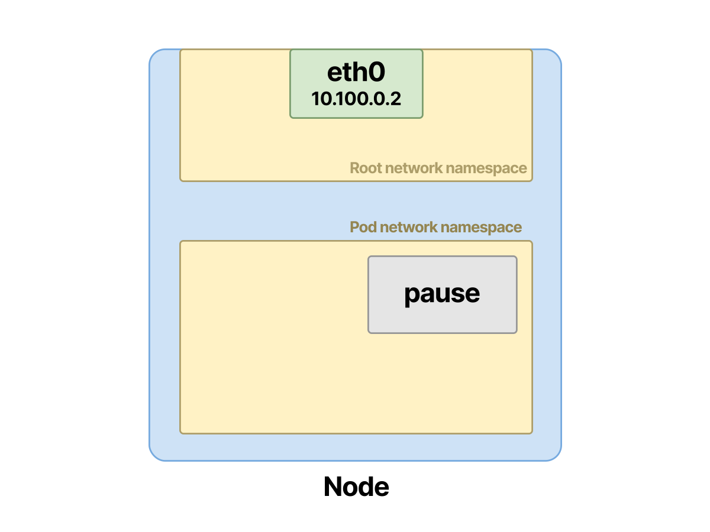
    
* 2/3 **Every other container in the pod joins the existing network namespace created by this container.**
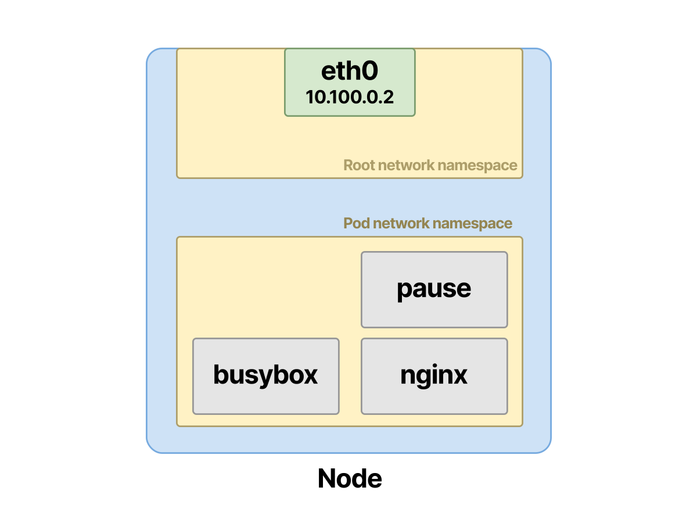
    
* 3/3 **At this point, the CNI assigns the IP address and attaches the containers to the network.**
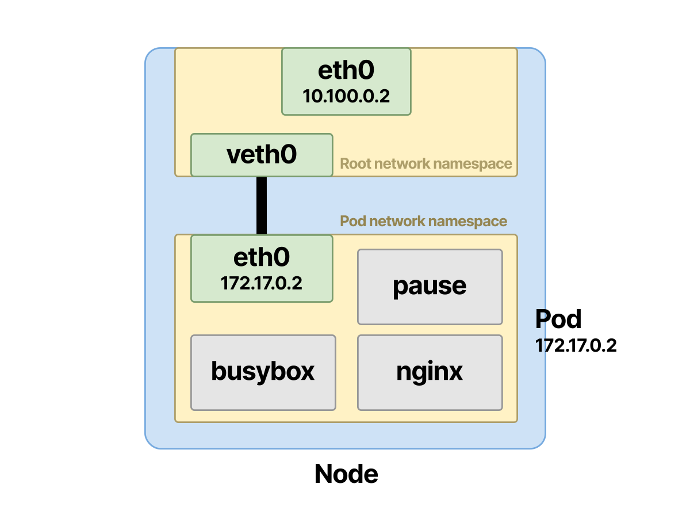

_How can a container that goes to sleep be useful?_

To understand its utility, let's imagine having a pod with two containers like in the previous example, but no `pause` container.

As soon as the container starts, the CNI:

1.  Makes the busybox container join the previous network namespace.
2.  Assigns an IP address.
3.  Attaches the containers to the network.

_What happens if the Nginx crashes?_

The CNI will have to go through all of the steps _again_ and the network will be disrupted for both containers.

Since it's unlikely that a `sleep` container can have any bug, it's usually a safer and more robust choice to create the network namespace.

**If one of the containers inside the pod crashes, the remaining can still reply to any network requests.**

The Pod is assigned a single IP address
---------------------------------------

I mentioned that the pod and both containers receive the same IP.

_How is that configured?_

**Inside the pod network namespace, an interface is created, and an IP address is assigned.**

Let's verify that.

First, find the pod's IP address:

```bash
kubectl get pod multi-container-pod -o jsonpath={.status.podIP}
10.244.4.40
```

Next, let's find the relevant network namespace.

Since network namespaces are created from a physical interface, you will have to access the cluster node.

> If you are running `minikube`, you can try `minikube ssh` to access the node. If you are running in a cloud provider, there should be some way to access the node over SSH.

Once you are in, let's find the latest named network namespace that was created:

```bash
ls -lt /var/run/netns
total 0
-r--r--r-- 1 root root 0 Sep 25 13:34 cni-0f226515-e28b-df13-9f16-dd79456825ac
-r--r--r-- 1 root root 0 Sep 24 09:39 cni-4e4dfaac-89a6-2034-6098-dd8b2ee51dcd
-r--r--r-- 1 root root 0 Sep 24 09:39 cni-7e94f0cc-9ee8-6a46-178a-55c73ce58f2e
-r--r--r-- 1 root root 0 Sep 24 09:39 cni-7619c818-5b66-5d45-91c1-1c516f559291
-r--r--r-- 1 root root 0 Sep 24 09:39 cni-3004ec2c-9ac2-2928-b556-82c7fb37a4d8
```

In this case it is `cni-0f226515-e28b-df13-9f16-dd79456825ac`.

Now you can run the `exec` command inside that namespace:

```bash
ip netns exec cni-0f226515-e28b-df13-9f16-dd79456825ac ip a
# output truncated
3: eth0@if12: <BROADCAST,MULTICAST,UP,LOWER_UP> mtu 1450 qdisc noqueue state UP group default
    link/ether 16:a4:f8:4f:56:77 brd ff:ff:ff:ff:ff:ff link-netnsid 0
    inet 10.244.4.40/32 brd 10.244.4.40 scope global eth0
       valid_lft forever preferred_lft forever
    inet6 fe80::14a4:f8ff:fe4f:5677/64 scope link
       valid_lft forever preferred_lft forever
```

**That's the IP address of the pod!**

Let's find out the other end of that interface by grepping for the `12` part of `@if12`.

```bash
ip link | grep -A1 ^12
12: vethweplb3f36a0@if16: mtu 1376 qdisc noqueue master weave state UP mode DEFAULT group default
    link/ether 72:1c:73:d9:d9:f6 brd ff:ff:ff:ff:ff:ff link-netnsid 1
```

You can also verify that the Nginx container listens for HTTP traffic from within that namespace:

```bash
ip netns exec cni-0f226515-e28b-df13-9f16-dd79456825ac netstat -lnp
Active Internet connections (only servers)
Proto Recv-Q Send-Q Local Address           Foreign Address         State       PID/Program name
tcp        0      0 0.0.0.0:80              0.0.0.0:*               LISTEN      692698/nginx: master
tcp6       0      0 :::80                   :::*                    LISTEN      692698/nginx: master
```

> If you can't get SSH access to the worker nodes in your cluster, you can use `kubectl exec` to get a shell to the busybox container and use the `ip` and `netstat` command directly inside.

_Excellent!_

Now that we covered the communication between the containers let's see how Pod-to-Pod communication is established.

Inspecting pod to pod traffic in the cluster
--------------------------------------------

When Pod-to-Pod communication comes into question, there are two possible scenarios:

1.  The pod traffic is destined to a pod on the same node.
2.  The pod traffic is destined to a pod that resides on a different node.

For the whole setup to work, we need the virtual interface pairs that we've discussed and ethernet bridges.

Before moving forward, let's discuss their function and why they are necessary.

**For a pod to communicate to other pods, it must first have access to the node's root namespace.**

This is achieved using a virtual ethernet pair connecting the two namespaces: pod and root.

Those [virtual interface devices](https://man7.org/linux/man-pages/man4/veth.4.html) (hence the `v` in `veth`) connect and act as a tunnel between the two namespaces.

With this `veth` device, you attach one end to the pod's namespace and the other to the root namespace.


The CNI does this for you, but you could also do this manually with:

```bash
ip link add veth1 netns pod-namespace type veth peer veth2 netns root
```

Now your pod's namespace has an access "tunnel" to the root namespace.

**Each newly created pod on the node will be set up with a `veth` pair like this.**

Creating the interface pairs is one part.

The other is assigning an address to the ethernet devices and creating the default routes.

Let's explore how to set up the `veth1` interface in the pod's namespace:

```bash
ip netns exec cni-0f226515-e28b-df13-9f16-dd79456825ac ip addr add 10.244.4.40/24 dev veth1
ip netns exec cni-0f226515-e28b-df13-9f16-dd79456825ac ip link set veth1 up
ip netns exec cni-0f226515-e28b-df13-9f16-dd79456825ac ip route add default via 10.244.4.40
```

On the node side, let's create the other `veth2` pair:

```bash
ip addr add 169.254.132.141/16 dev veth2
ip link set veth2 up
```

You can inspect the existing `veth` pairs as you did previously.

In the pod's namespace, retrieve the suffix of the `eth0` interface.

```bash
ip netns exec cni-0f226515-e28b-df13-9f16-dd79456825ac ip link show type veth
3: eth0@if12: <BROADCAST,MULTICAST,UP,LOWER_UP> mtu 1450 qdisc noqueue state UP mode DEFAULT group default
    link/ether 16:a4:f8:4f:56:77 brd ff:ff:ff:ff:ff:ff link-netnsid 0
```

In this case, you can grep for `grep -A1 ^12` (or just scroll through the output):

```bash
ip link show type veth
# output truncated
12: cali97e50e215bd@if3: <BROADCAST,MULTICAST,UP,LOWER_UP> mtu 1450 qdisc noqueue state UP mode DEFAULT group default
    link/ether ee:ee:ee:ee:ee:ee brd ff:ff:ff:ff:ff:ff link-netns cni-0f226515-e28b-df13-9f16-dd79456825ac
```

> You can also use `ip -n cni-0f226515-e28b-df13-9f16-dd79456825ac link show type veth`.

Pay attention to the notation on both `3: eth0@if12` and `12: cali97e50e215bd@if3` interfaces.

From the pod namespace, the `eth0` interface connects to interface number 12 in the root namespace. Hence the `@if12`.

On the other end of the `veth` pair, the root namespace is connected to the pod namespace interface number 3.

Next comes the bridge that will connect each end of the `veth` pairs.

The pod network namespace is connected to an ethernet bridge
------------------------------------------------------------

The bridge will 'tie' together each end of the virtual interfaces located in the root namespace.

**This bridge will allow traffic to flow between virtual pairs and traverse through the common root namespace.**

_Theory time._

An ethernet bridge is located at layer 2 of [the OSI networking model.](https://en.wikipedia.org/wiki/OSI_model)

[You can think of the bridge as a virtual switch accepting connections from different namespaces and interfaces.](https://ops.tips/blog/using-network-namespaces-and-bridge-to-isolate-servers/)

**The ethernet bridge allows you to connect multiple available networks on the same node.**

So you can use this setup and bridge the two interfaces, the `veth` from the pod namespace to the other pod `veth` on the node.

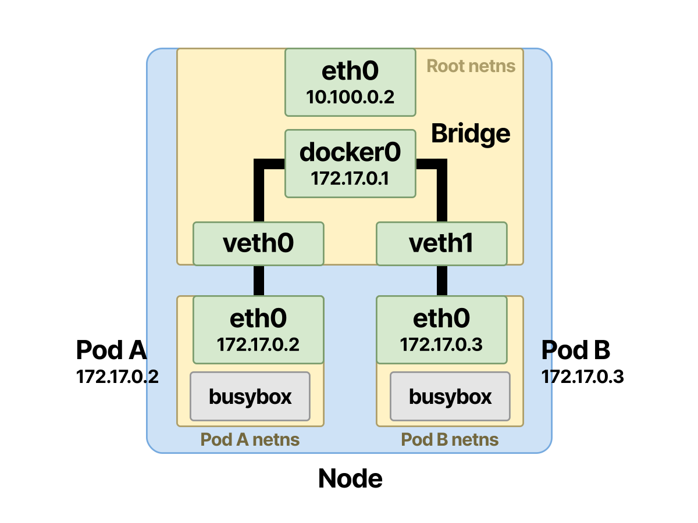

Let's have a look at ethernet bridge and veth pairs in action.

Tracing pod to pod traffic on the same node
-------------------------------------------

Let's assume there are two pods on the same node, and Pod-A wants to send a message to Pod-B.

* 1/5  **Since the destination isn't one of the containers in the namespace, Pod-A sends out a packet to its default interface `eth0`. This interface is tied to the one end of the `veth` pair and serves as a tunnel. With that, packets are forwarded to the root namespace on the node.**

    
* 2/5 **The ethernet bridge, acting as a virtual switch, has to somehow resolve the destination pod IP (Pod-B) to its MAC address.**  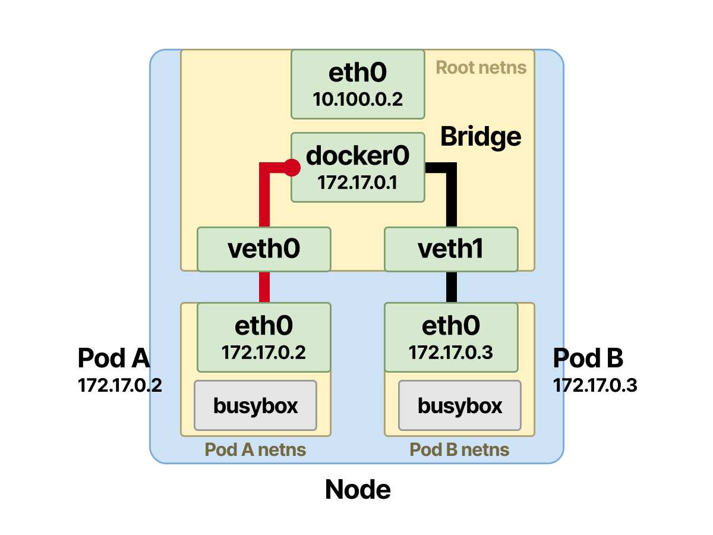
    
* 3/5 **The ARP protocol comes to the rescue. An ARP broadcast is sent on all connected devices when the frame reaches the bridge. The bridge shouts _Who has Pod-B IP address?_** 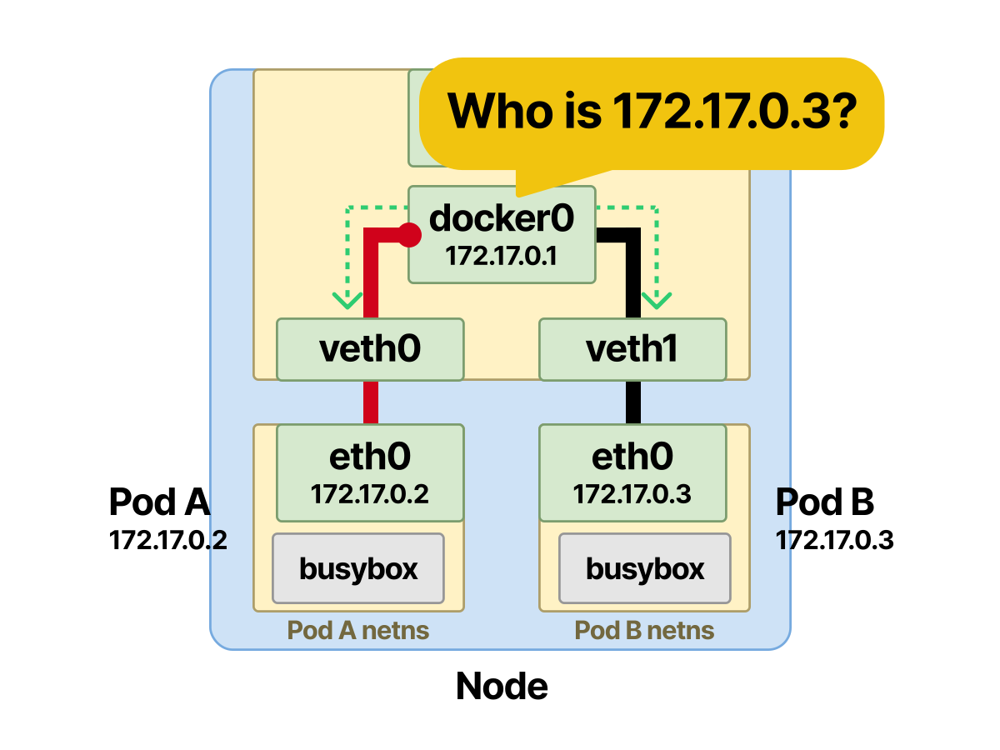
    
* 4/5 **A reply is received with the MAC address of the interface that connects Pod-B, then this information is stored in the bridge ARP cache (lookup table).**
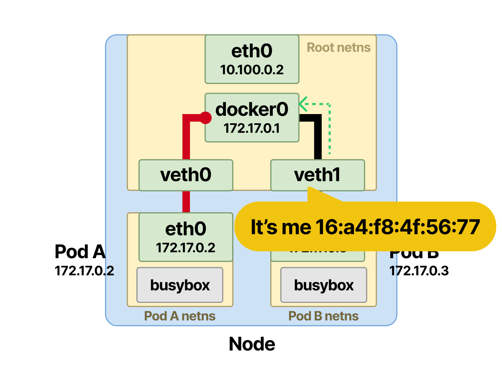
    
* 5/5 **Once the mapping of the IP and MAC address is stored, the bridge looks up in the table and forwards the packet to the correct endpoint. The packet reaches Pod-B `veth` in the root namespace, and from there, it quickly reaches the `eth0` interface inside the Pod-B namespace.**

    
With this, the communication between Pod-A and Pod-B has been successful.

Tracing pod to pod communication on different nodes
---------------------------------------------------

For pods that need to communicate across different nodes, an additional hop in the communication is required.

* 1/2 **The first couple of steps stay the same, up to the point when the packet arrives in the root namespace and needs to be sent over to Pod-B.**
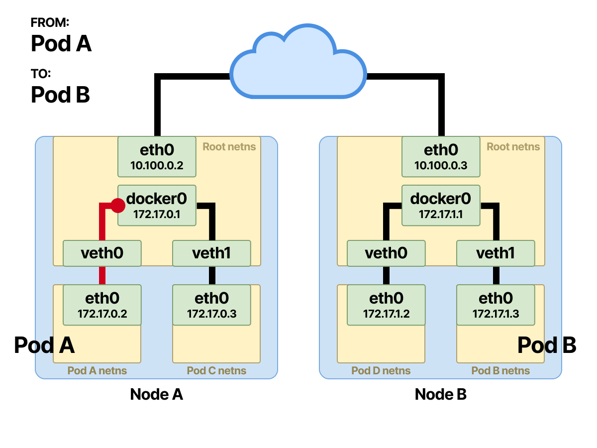
    
* 2/2 **When the destination IP is not in the local network, the packet is forwarded to the default gateway of that node. The exit or default gateway on the node is usually on the `eth0` interface — the physical interface that connects the node to the network.**
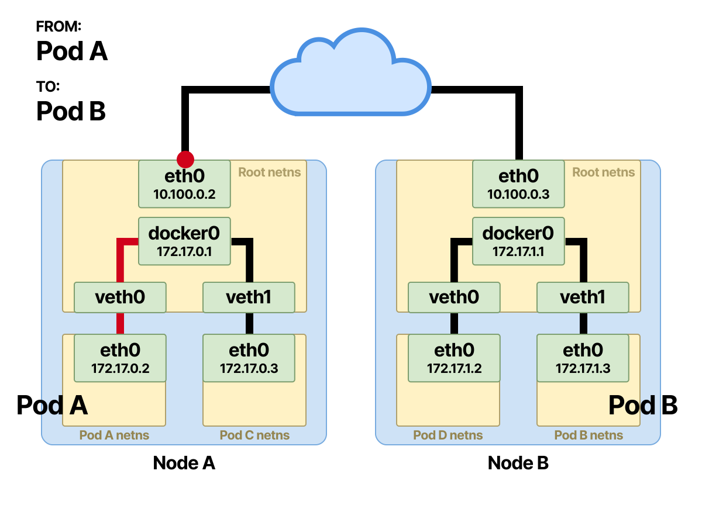
    
**This time, the ARP resolution doesn't happen because the source and the destination IP are on different networks.**

The check is done using a Bitwise operation.

When the destination IP isn't on the current network, it is forwarded to the default gateway of the node.

### How the Bitwise operation works

The source node must perform a bitwise operation when determining where the packet should be forwarded.

[This operation is also known as ANDing.](https://en.wikipedia.org/wiki/Bitwise_operation#AND)

As a refresher, the bitwise AND operation yields the following:

```bash
    0 AND 0 = 0
    0 AND 1 = 0
    1 AND 0 = 0
    1 AND 1 = 1
```
Anything apart from `1` and `1` will be false.

If the source node has an IP of 192.168.1.1 with a subnet mask of /24, and the destination IP is 172.16.1.1/16, the bitwise AND operation will state that they are indeed on different networks.

Meaning the destination IP isn't on the same network as the packet's source, so that the packet will be forwarded throughout the default gateway.

_Math time._

We must start with the 32-bit addresses in binary to do the AND operation.

Let's first find out the source and destination IP networks.

    | Type             | Binary                              | Converted          |
    | ---------------- | ----------------------------------- | ------------------ |
    | Src. IP Address  | 11000000.10101000.00000001.00000001 | 192.168.1.1        |
    | Src. Subnet Mask | 11111111.11111111.11111111.00000000 | 255.255.255.0(/24) |
    | Src. Network     | 11000000.10101000.00000001.00000000 | 192.168.1.0        |
    |                  |                                     |                    |
    | Dst. IP Address  | 10101100.00010000.00000001.00000001 | 172.16.1.1         |
    | Dst. Subnet Mask | 11111111.11111111.00000000.00000000 | 255.255.0.0(/16)   |
    | Dst. Network     | 10101100.00010000.00000000.00000000 | 172.16.0.0         |

For the bitwise operation, you need to compare the destination IP to the source subnet of the node from where the packet originates.

    | Type             | Binary                              | Converted          |
    | ---------------- | ----------------------------------- | ------------------ |
    | Dst. IP Address  | 10101100.00010000.00000001.00000001 | 172.16.1.1         |
    | Src. Subnet Mask | 11111111.11111111.11111111.00000000 | 255.255.255.0(/24) |
    | Network  Result  | 10101100.00010000.00000001.00000000 | 172.16.1.0         |

As we can see, the ANDed network results in 172.16.1.0, which doesn't equal to 192.168.1.0 - the network from the source node.

_With this, we confirm that the source and destination IP addresses don't reside on the same network._

For example, if the destination IP was 192.168.1.2, i.e. in the same subnet as the sending IP, the AND operation will yield the local network of the node.

    | Type             | Binary                              | Converted          |
    | ---------------- | ----------------------------------- | ------------------ |
    | Dst. IP Address  | 11000000.10101000.00000001.00000010 | 192.168.1.2        |
    | Src. Subnet Mask | 11111111.11111111.11111111.00000000 | 255.255.255.0(/24) |
    | Network          | 11000000.10101000.00000001.00000000 | 192.168.1.0        |

After the bitwise comparison is made, the ARP will check its lookup table for the MAC address of the default gateway.

If there is an entry, it will immediately forward the packet.

Otherwise, it will first do a broadcast to determine the MAC address of the gateway.

* 1/4 **The packet now is routed to the default interface of the other node. Let's call it Node-B.**

    
* 2/4 **In the reverse order. The packet is now at the root namespace of Node-B and reaches the bridge, where another ARP resolution will take place.**

    
* 3/4 **A reply is received with the MAC address of the interface that connects Pod-B.**

    
* 4/4 **This time the bridge forwards the frame through the Pod-B `veth` device, and it reaches Pod-B in its own namespace.**


Now that you are familiar with how the traffic flows between the pods let's take the time to explore how a CNI creates the above.

The Container Network Interface - CNI
-------------------------------------

[The Container Network Interface (CNI) is concerned about the networking in the current node.](https://github.com/containernetworking/cni/blob/master/SPEC.md)

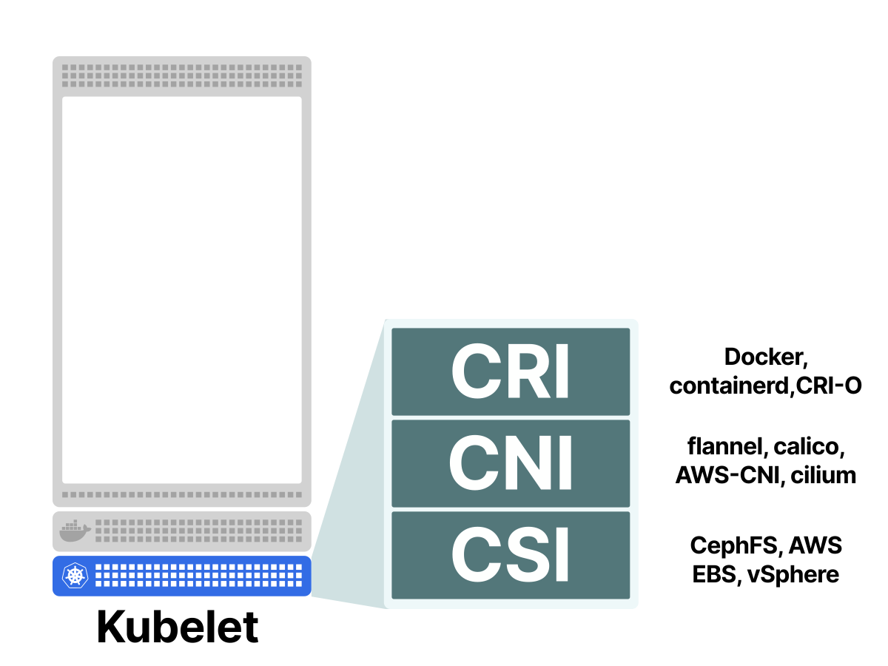

**You can think of the CNI as a set of rules that a networking plugin should follow to solve _some_ of the Kubernetes network requirements.**

However, this isn't tied only to Kubernetes or a specific network plugin.

You can use any CNI:

*   [Calico](https://www.tigera.io/project-calico/)
*   [Cillium](https://cilium.io/)
*   [Flannel](https://github.com/flannel-io/flannel)
*   [Weave Net](https://www.weave.works/docs/net/latest/overview/)
*   [and a lot of other network plugins.](https://github.com/containernetworking/cni#3rd-party-plugins)

They all implement the same CNI standard.

Without a CNI in place, you would need to manually:

*   Create interfaces.
*   Create veth pairs.
*   Set up the namespace networking.
*   Set up static routes.
*   Configure an ethernet bridge.
*   Assign IP addresses.
*   Create NAT rules.

And a plethora of other things that will require excessive manual work.

Not to mention deleting or adjusting all of the above when a pod needs to be deleted or restarted.

The CNI must support [four distinct operations](https://github.com/containernetworking/cni/blob/master/SPEC.md#cni-operations):

*   **ADD** - adds a container to the network.
*   **DEL** - deletes a container from the network.
*   **CHECK** - returns an error if there is a problem with the container's network.
*   **VERSION** - displays the version of the plugin.

_Let's see how it works in practice._

When a pod gets assigned to a specific node, the kubelet itself doesn't initialize the networking.

Instead, it offloads this task to the CNI.

**However, it does specify the configuration and sends it over in a JSON format to the CNI plugin.**

You can navigate to `/etc/cni/net.d` on the node and check the current CNI configuration file with:

```bash
cat 10-calico.conflist
{
  "name": "k8s-pod-network",
  "cniVersion": "0.3.1",
  "plugins": [
    {
      "type": "calico",
      "datastore_type": "kubernetes",
      "mtu": 0,
      "nodename_file_optional": false,
      "log_level": "Info",
      "log_file_path": "/var/log/calico/cni/cni.log",
      "ipam": { "type": "calico-ipam", "assign_ipv4" : "true", "assign_ipv6" : "false"},
      "container_settings": {
          "allow_ip_forwarding": false
      },
      "policy": {
          "type": "k8s"
      },
      "kubernetes": {
          "k8s_api_root":"https://10.96.0.1:443",
          "kubeconfig": "/etc/cni/net.d/calico-kubeconfig"
      }
    },
    {
      "type": "bandwidth",
      "capabilities": {"bandwidth": true}
    },
    {"type": "portmap", "snat": true, "capabilities": {"portMappings": true}}
  ]
}
```

**Each CNI plugin uses a different type of configuration for the network setup.**

For example, Calico uses layer 3 networking paired with the BGP routing protocol to connect pods.

Cilium configures an overlay network with eBPF on layers 3 to 7.

Along with Calico, Cilium supports setting up network policies to restrict traffic.

_So which one should you use?_

It depends.

There are mainly two groups of CNIs.

**In the first group, you can find CNIs that use a basic network setup (also called a flat network)** and assign IP addresses to pods from the cluster's IP pool.

This could become a burden as you might quickly exhaust all available IP addresses.

**Instead, another approach is to use overlay networking.**

In simple terms, an overlay network is a secondary network on top of the main (underlay) network.

**The overlay network works by encapsulating any packet originating from the underlay network that is destined to a pod on another node.**

A popular technology for overlay networks is [VXLAN](https://iximiuz.com/en/posts/computer-networking-101/), which enables tunnelling L2 domains over an L3 network.

_So which one is better?_

**There isn't a single answer, and it usually comes down to your requirements.**

_Are you building a large cluster with tens of thousands of nodes?_

Maybe an overlay is better.

_Do you value a simpler setup and the ability to inspect your network traffic without being lost in nested networks?_

A flat network is perfect for you.

Now that we've discussed the CNI let's explore how Pod-to-Service communication works.

Inspecting Pod to Service traffic
----------------------------------

Due to the dynamic nature of the pods in Kubernetes environments, the IP addresses that are assigned to them aren't static.

**They are ephemeral and change every time a pod is created or deleted.**

The service addresses this issue and provides a stable mechanism for connecting to a set of pods.

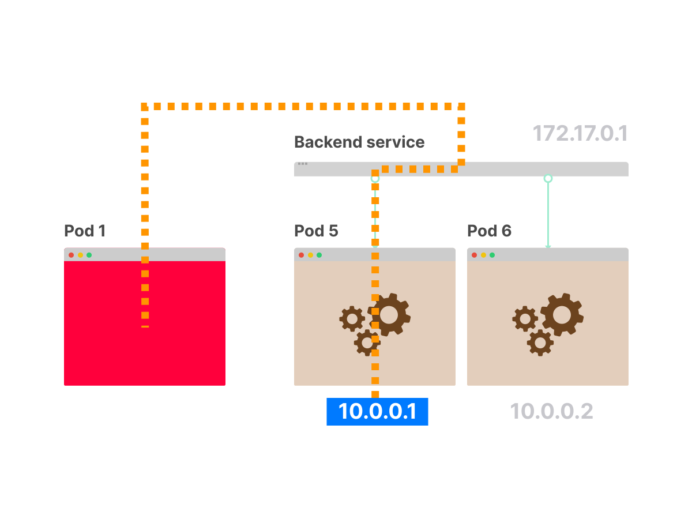

By default, when you create a service in Kubernetes, [a virtual IP is reserved and assigned to it.](https://kubernetes.io/docs/concepts/services-networking/service/#virtual-ips-and-service-proxies)

From there, using selectors, you associate the service to the target pods.

_What happens when a pod is deleted, and a new one is added?_

**The service's virtual IP remains static and unchanged.**

However, the traffic will reach the newly created pods without the need for intervention.

In other words, services in Kubernetes are similar to load balancers.

_But how do they work?_

Intercepting and rewriting traffic with Netfilter and Iptables
--------------------------------------------------------------

The service in Kubernetes is built upon two Linux kernel components:

1.  [Netfilter](https://en.wikipedia.org/wiki/Netfilter) and
2.  [iptables](https://en.wikipedia.org/wiki/Iptables).

**Netfilter is a framework that allows to configure packet filtering, create NAT or port translation rules, and manage the traffic flow in the network.**

In addition, it also shields and prevents unsolicited connections to reach the services.

**Iptables, on the other hand, is a user-space utility program that allows you to configure the IP packet filter rules of the Linux kernel firewall.**

The iptables are implemented as different Netfilter modules.

You use the iptables CLI to alter the filtering rules on the fly and insert them into netfilters hooking points.

The filters are organized in different tables, which contain chains for handling network traffic packets.

Different kernel modules and programs are used for each protocol.

> When iptables is mentioned, it generally means the usage is for IPv4. For IPv6 rules, the CLI is called ip6tables.

Iptables has five types of chains, and each chain directly maps to the Netfilter's hooks.

From iptables point of view, they are:

*   `PRE_ROUTING`
*   `INPUT`
*   `FORWARD`
*   `OUTPUT`
*   `POST_ROUTING`

And they correspondingly map to Netfilter hooks:

*   `NF_IP_PRE_ROUTING`
*   `NF_IP_LOCAL_IN`
*   `NF_IP_FORWARD`
*   `NF_IP_LOCAL_OUT`
*   `NF_IP_POST_ROUTING`

When a packet arrives, and depending on which stage it is, it will 'trigger' a Netfilter hook, which applies a specific iptables filtering.

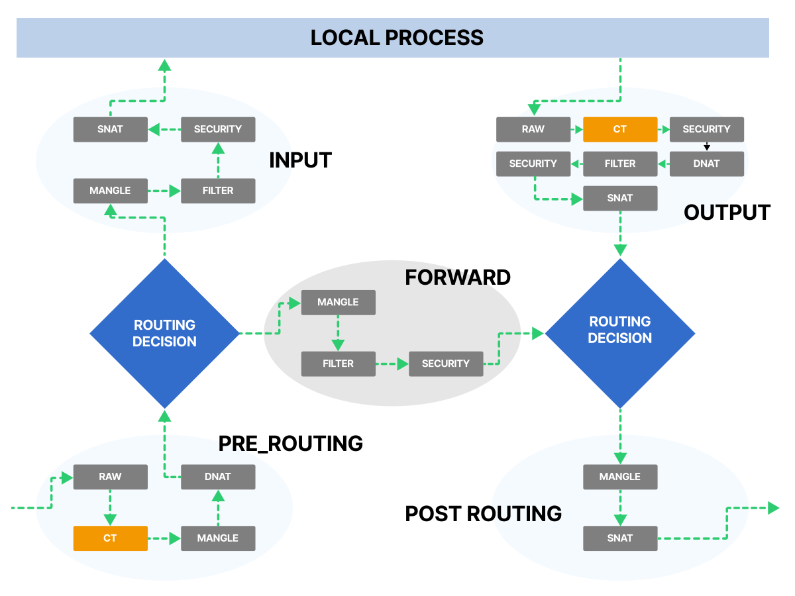

_Yikes! That looks complex!_

Nothing to worry though.

That's why we use Kubernetes, all of the above is abstracted through the use of services, and a simple YAML definition sets those rules automatically.

If you are interested in seeing the iptables rules, you can connect to a node and run:

```bash
iptables-save
```

You can also [use this tool to visualize](https://github.com/Nudin/iptable_vis) the iptables chains on a node.

Example diagram with visualized iptables chains, taken from a GKE node:

[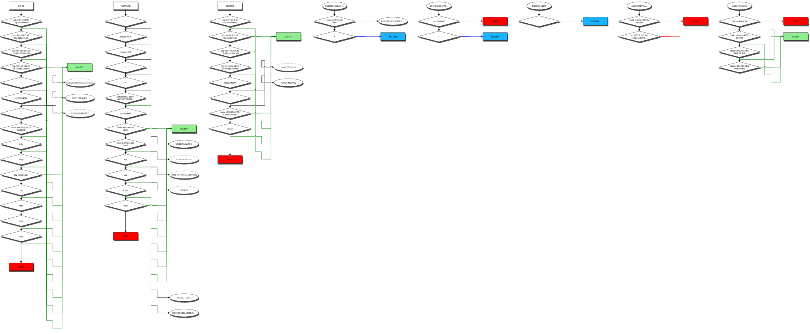](https://svgshare.com/i/bgz.svg)

_Keep in mind that there may be hundreds of rules configured. Imagine creating them by hand!_

We have explained how Pod-to-Pod communication happens when pods are on the same and different nodes.

In Pod-to-Service, the first half of the communication stays the same.

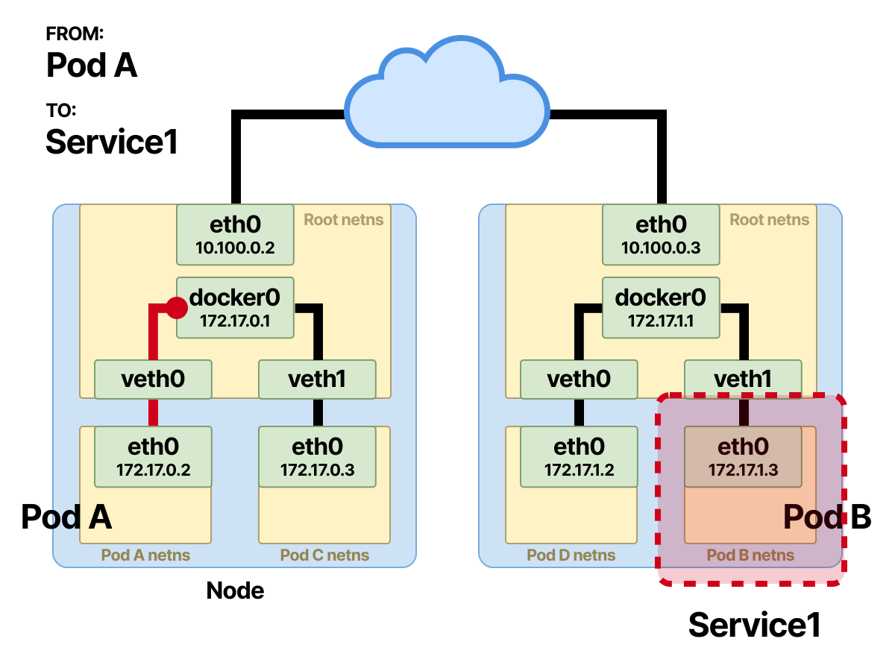

When the request starts at Pod-A, and it wants to reach Pod-B, which in this case will be 'behind' a service, there is an additional change happening halfway through the transfer.

The originating request exits through the `eth0` interface in the Pod-A namespace.

From there, it goes through the `veth` pair and reaches the root namespace ethernet bridge.

Once at the bridge, the packet gets immediately forwarded through the default gateway.

As in the Pod-to-Pod section, the host makes a bitwise comparison, and because the vIP of the service isn't part of the node's CIDR, the packet will be instantly forwarded through the default gateway.

The same ARP resolution will happen to find out the MAC address of the default gateway if it isn't already present in the lookup table.

_Now the magic happens._

Just before that packet goes through the routing process of the node, the `NF_IP_PRE_ROUTING` Netfilter hook gets triggered, and an iptables rule is applied. The rule does a DNAT change and rewrites Pod's A packet destination IP.

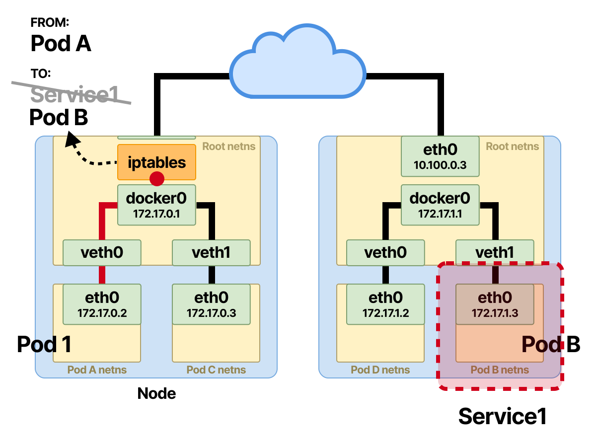

The previous service vIP destination gets rewritten to the Pod's B IP address.

From there, the routing is just as same as directly communicating Pod-to-Pod.

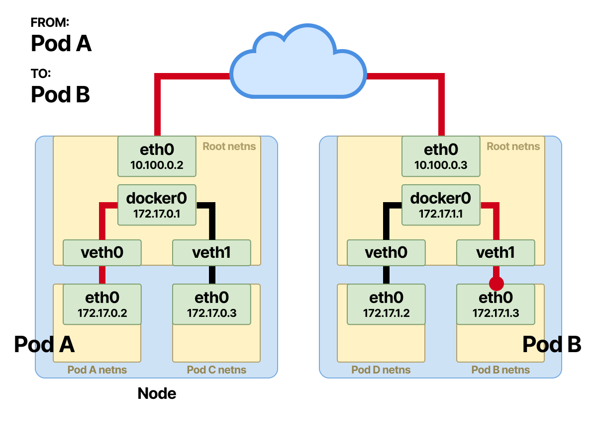

However, in between all this communication, another third feature is utilized.

[This feature is called conntrack](https://www.linuxtopia.org/Linux_Firewall_iptables/x1298.html), or connection tracking.

**Conntrack will associate the packet to the connection and keep track of its origin when a response is sent back by Pod-B.**

The NAT heavily relies on conntrack to work.

Without connection tracking, it wouldn't know where to send back the packet containing the response.

When conntrack is used, the return path of the packets is easily set up with the same source or destination NAT change.

The other half is now in the reverse order.

Pod-B received and processed the request and now sends back data to Pod-A.

_What happens now?_

Inspecting responses from Services
----------------------------------

Now Pod-B sends the response, setting up its IP address as source and Pod's A IP address as the destination.

* 1/3 **When the packet reaches the interface at the node, where Pod-A is located, another NAT happens.**
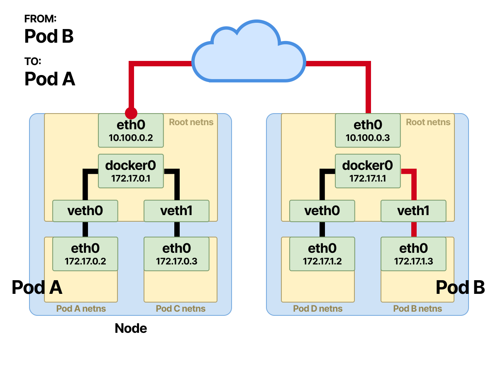
    
* 2/3 **This time, using conntrack, the source IP address changes, the iptables rule does a SNAT, and swaps Pod's B source IP to the vIP of the original service.**
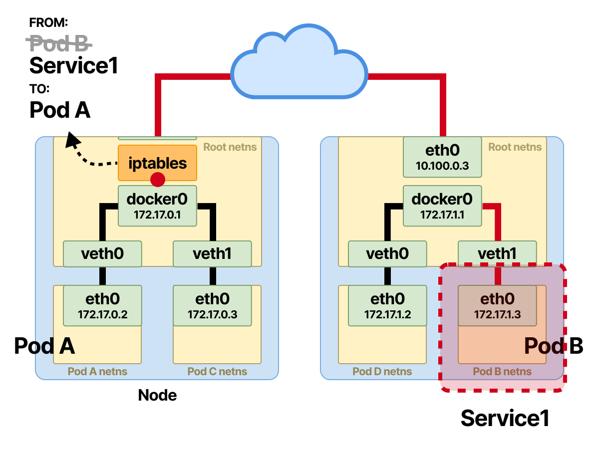
    
* 3/3 **For Pod-A, this looks as if the incoming response originates from the service and not Pod-B.**
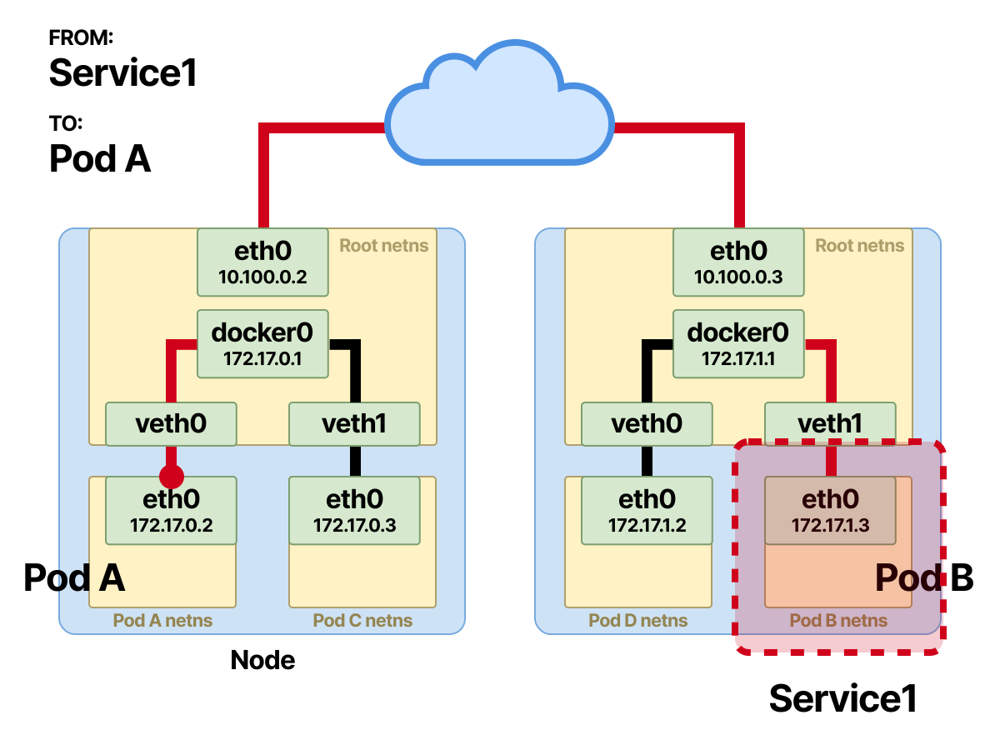
    
The rest is the same; once the SNAT is done, the packet reaches the ethernet bridge in the root namespace and gets forwarded through the veth pair to Pod-A.

Recap
-----

Let's do a recap on what you've learned in this article:

*   How containers talk locally or Intra-Pod communication.
*   Pod-to-Pod communication when the pods are on the same and different nodes.
*   Pod-to-Service - when pod sends traffic to another pod behind a service in Kubernetes.
*   What are namespaces, veth, iptables, chains, conntrack, Netfilter, CNIs, overlay networks, and everything else in the Kubernetes networking toolbox required for effective communication.

