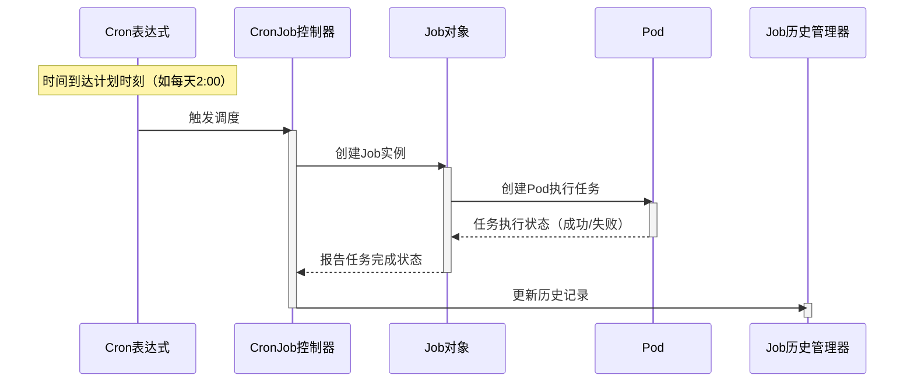

# 从入门到精通：全面解读 Kubernetes CronJobs

> **作者**：`Scaibu`<br/>
> **原文地址**：https://scaibu.medium.com/technical-deep-dive-into-kubernetes-cronjobs-automation-at-scale-c258864a3bf0

## 引言

在基于 `Kubernetes` 的云原生环境中，高效且精确地管理定时任务至关重要。这正是 **CronJobs** 的闪光点——它提供了一种可靠且自动化的方式来管理重复性任务。无论是清理日志、发送邮件报告、备份数据库，还是运行健康检查，`CronJobs` 允许开发者和运维人员将这些重复性任务交给 `Kubernetes`，从而确保操作的流畅性和可预测性。

`CronJobs` 可以被视为**传统 Unix 系统中的 cron 任务**，但当它们被集成到可扩展且动态的 `Kubernetes` 生态系统中时，功能更加强大。它们基于 **cron 表达式**自动化工作负载，并在指定时间间隔创建 **Jobs** 来运行定义的任务。这确保了周期性任务无需人工持续监督即可处理，提高了整体效率并减少了人为错误。

本文将深入探讨 `Kubernetes CronJobs` 的工作原理、配置方法、最佳实践以及实际用例，以说明如何有效利用它们。

## Kubernetes 中的 CronJobs 是什么？

在 `Kubernetes` 中，**CronJobs** 用于按计划运行 `Jobs`。`CronJob` 控制器负责管理调度，允许你在指定时间间隔执行任务。`CronJobs` 非常适合需要自动化周期性或基于时间的任务的场景，例如备份、发送邮件或运行批处理任务。

当 `CronJob` 的调度触发时（基于指定的 `cron` 表达式），它会创建一个 **Job** 资源来执行任务。Job 随后运行一个或多个 **Pods** 来执行任务。任务完成后，Pod 退出，CronJob 等待下一次计划执行。

## CronJob 关键配置项

### 1. Cron 表达式

**Cron 表达式** 是一个字符串，用于定义 `CronJob` 的调度计划。它与 `Unix` 系统中的 `cron` 任务调度器类似，允许你指定任务运行的频率和时间。表达式由五个字段组成：

*   **分钟**：`0–59`  
*   **小时**：`0–23`（24 小时制）  
*   **日期**：`1–31`  
*   **月份**：`1–12`  
*   **星期**：`0–6`（周日到周六）

```plaintext
schedule: "0 2 * * *"
```
此表达式表示 CronJob 将在**每天凌晨 2:00** 运行。

### 2. Job 模板

**Job 模板** 定义了 `CronJob` 要执行的任务。它包含运行任务的容器规范、环境变量、卷挂载以及其他运行任务所需的参数。它本质上是将要创建的实际 `Job` 资源的蓝图。

### 3. Pods

**Pod** 是 `Kubernetes` 中最小的可部署单元。一个 `Pod` 运行一个或多个执行实际工作负载的容器。当 `CronJob` 触发 `Job` 时，它会创建执行任务的 `Pod`。任务完成后，`Pod` 退出。根据 `CronJob` 的配置，`Pod` 可能会被设置为重启或终止。

## CronJob、Job 与 Pod 之间的关系

**CronJob**、**Job** 和 **Pod** 之间的关系可简化为以下流程：

### CronJob

`Kubernetes` 中的 **CronJob** 用于按时间计划自动执行任务。这些任务通常是需要周期性运行但与持续运行的应用或服务无关的批处理作业。

*   **Job 历史控制**：默认情况下，`Kubernetes` 会保留 `CronJob` 创建的 `Job` 历史。我们可以通过 `CronJob` 配置中的 `successfulJobsHistoryLimit` 和 `failedJobsHistoryLimit` 字段控制保留的成功或失败 `Job` 数量。这一点非常重要，因为保留过多的历史 `Job` 可能导致资源消耗（例如填满 `etcd` 数据库或占用不必要的存储空间）。
*   **Job 回退策略**：`CronJob` 控制器内置了**回退（backoff）**机制来处理失败。如果 `Job` 失败，`Kubernetes` 会在回退期后重试。我们可以通过 `backoffLimit` 和 `retryDeadlineSeconds` 字段配置重试行为，以确定允许的重试次数和重试时间窗口。
*   **时区考虑**：`Kubernetes` 的 `CronJobs` 默认使用 `UTC` 时区，这可能与本地时间相关的任务产生混淆。正确处理时区的方法包括调整 `cron` 表达式以适配 `UTC`，或在任务逻辑中实现时区转换。
*   **执行延迟与重叠**：`CronJobs` 不保证 `Job` 的精确启动时间。如果一个 `Job` 运行时间较长且下一次执行时间到达，可能会导致下一次 `Job` 延迟执行。如果 `concurrencyPolicy` 设置为 `Forbid`，则下一次 `Job` 将不会运行，直到前一个 `Job` 完成，这可能导致错过多次执行。

> 译者补充：在 Kubernetes 中，CronJob 的 concurrencyPolicy 是一个关键的字段，用于定义当一个计划任务尚未完成时，是否允许启动新的任务。此字段的设置可以有效管理任务的并发行为，防止资源竞争或任务冲突。
> 
| **策略**      | **含义**                                | **行为**                                                                 | **适用场景**                          |
|----------------|-----------------------------------------|--------------------------------------------------------------------------|---------------------------------------|
| **Allow**      | 允许多个任务同时运行                    | 新任务可以启动，即使已有任务尚未完成。                                   | 任务独立且无冲突，如日志清理、数据备份。|
| **Forbid**     | 禁止任务并发运行                        | 如果已有任务尚未完成，跳过新任务的启动。                                  | 任务需互斥运行，如数据库更新、报表生成。|
| **Replace**    | 终止旧任务并启动新任务                  | 如果已有任务未完成，先终止旧任务再启动新任务。                             | 保证最新任务优先，如监控数据刷新。      |

**CronJob 作为控制器**：

* `CronJob` 本身是一个 `Kubernetes` 控制器，持续监视系统时钟并根据 `cron` 表达式决定何时触发下一个 `Job`。这使其高效，但也可能因集群负载过高而引入延迟。

**资源扩缩容考虑**：

* `CronJob` 会根据计划创建 `Jobs` 和 `Pods`，但这些 `Jobs` 可能需要大量资源（`CPU`、内存、网络带宽）。当多个 `CronJobs` 并发执行或任务涉及高密度计算（例如大数据处理）时，需特别注意资源消耗。

**外部依赖**： 

* 如果 `CronJob` 依赖外部服务（如 `API`、数据库），需要为服务中断或超时实现适当的错误处理。如果任务运行时外部服务不可用，任务可能失败，因此在 `Job` 模板（甚至 `CronJob` 本身）中设置重试机制至关重要。

### Job

`Kubernetes` 中的 **Job** 定义了需要运行完成的一个或多个任务。**CronJob** 控制器在指定时间创建 Jobs，但需注意许多重要配置选项以确保任务按预期运行。

**Pod 规范**： 

* `Job` 可以通过模板创建 **Pod**，模板定义了容器、卷和其他任务所需的资源。**Pod 模板**定义了任务运行的环境，包括 Docker 镜像、资源请求与限制、环境变量等配置。
* 如果 `Jo`b 需要创建多个 `Pod`（并行执行），需确保 `Pod` 是**无状态的**（或可以独立运行），除非使用 `StatefulSet` 管理有状态工作负载。

**完成与清理**：
 
* 当 `Job` 运行完成（成功或重试耗尽）后，`Kubernetes` 将**清理**其创建的 `Pod`（除非显式配置保留）。`Job` 配置中的 `ttlSecondsAfterFinished` 字段可用于定义清理完成 `Pod` 的等待时间。这在可能触发大量 `Jobs` 的环境中尤为重要，以避免不必要的资源占用。

**处理失败**：

* `Job` 可以根据失败情况进行重试。通过设置 `backoffLimit`（重试次数）和 `retryDeadlineSeconds`（重试时间窗口），可以定义重试策略。但如果重试耗尽后任务仍失败，可能需要手动干预或通知系统来提醒运维人员。
* **Job 控制器垃圾回收**：如果 `Job` 创建的 `Pod` 反复失败，`Kubernetes` 可能会积累大量失败 `Pod`。需通过配置 `Job` 历史或自动清理失败 `Job` 来避免这一问题。

### 概念

**Job 历史与重试**： 

* `Kubernetes` 默认会创建 **Job 历史** 以跟踪成功和失败的 `Jobs`。但如果存在大量定时任务，需合理配置 `successfulJobsHistoryLimit` 和 `failedJobsHistoryLimit`，否则可能导致历史数据过多和资源占用。如果不需要跟踪任务完成情况，也可以完全禁用历史记录。

**工作负载调度与重叠 Jobs**： 

* 需监控 **多个 Jobs** 是否可以并发运行（尤其是使用 `Allow` 并发策略时）。如果任务执行时间不可预测，并发运行多个实例可能导致资源过度消耗，影响集群性能。

**优先级与抢占**： 

* `Kubernetes` 支持**优先级类（Priority Classes）**。若某个 `Job` 至关重要且需在资源紧张时优先运行，可为其分配较高优先级。抢占机制会驱逐低优先级 Pod 以释放资源。

### Pods

**Pod** 是 `Kubernetes` 中的最小执行单元，包含一个或多个容器。它由 **Job** 创建以运行任务。当 `Pod` 用于 `CronJobs` 启动的任务时，需注意以下关键点：

**1. 临时性**：

* `Pod` 是临时性的。任务成功完成后，`Pod` 通常会被终止。但在失败或未完成的情况下，`Pod` 可能停留更长时间。需通过 `restartPolicy`、`ttlSecondsAfterFinished` 和 `activeDeadlineSeconds` 管理生命周期，确保及时清理无用 `Pod`。
* **Pod 中断**：如果 `Pod` 运行的节点发生故障，`Kubernetes` 可能将其重新调度到其他节点，这可能导致任务完成延迟。配置 **Pod 亲和性**和**污点/容忍**可增强调度弹性。

**2. 资源使用与扩缩容**：

* **请求与限制**：`Pod` 中的每个容器可设置 `resources.requests`（最低资源分配）和 `resources.limits`（最高资源分配）。若未正确设置，可能导致任务因资源不足失败或过度占用资源影响其他工作负载。
* **水平 Pod 自动扩缩（HPA）**：若任务资源密集且可并行化，可考虑使用 `HPA` 根据资源消耗或负载动态调整 `Pod` 数量。

> **译者**：`HPA `不支持 `CronJob`，因为 `CronJob` 的 `Pod` 是一次性任务，无法实现动态扩缩。建议通过资源限制 (`resources.requests/limits`)、任务并发 (`parallelism`) 和集群自动扩展 (`Cluster Autoscaler`) 来优化 `CronJob` 的资源利用和任务运行可靠性。
> 
> `Parallelism` 是一个 `Job` 的字段，用于定义任务的并发运行数。通过设置 `Parallelism`，我们可以控制同时运行的 `Pod` 数量，从而更高效地利用资源或控制任务的执行速率。
> 
> 1.	**限制并发数**：`Parallelism` 决定了同时运行的 `Pod` 上限，即使 `Job.spec.completions` 的总数更大，也会严格遵守该限制。
> 2.	**完成所有任务**：当 `completions` 数大于 `parallelism` 时，任务会分批执行，直到所有任务完成。
> 
```yaml
apiVersion: batch/v1
kind: Job
metadata:
  name: parallel-job
spec:
  completions: 10              # 总任务数
  parallelism: 3               # 最大并发任务数
  template:
    spec:
      containers:
      - name: example-container
        image: busybox
        command: ["sh", "-c", "echo Processing $(date); sleep 5"]
      restartPolicy: OnFailure
```
> 1.	系统会首先启动 3 个 `Pod`。
2.	每当一个 `Pod` 完成任务（任务耗时 5 秒），就会启动一个新的 `Pod`。
3.	最终，`10 `个任务被分成多批次（每批最多 `3` 个 Pod）完成。

**3. Pod 分布与亲和性**：

* **节点亲和性**：对于时间敏感任务，可让 `Pod` 在特定节点（如高 `CPU` 节点）上运行。`Kubernetes` 提供 **亲和性（Affinity）** 和 **反亲和性（Anti-Affinity）** 设置来实现。
* **Pod 亲和性/反亲和性**可用于将 `Pod` 调度到与其他相关 `Pod` 同一节点（例如数据本地性），或分散 `Pod` 以避免单点故障。

#### 一些相关概念

**Pod 生命周期管理**：

* `Pod` 在 `Kubernetes` 中会经历 `Pending`、`Running`、`Succeeded/Failed` 等状态。了解生命周期对调试和确保任务正确执行至关重要，尤其是处理并行 Pod 或重试时。

**Pod 终止处理**：

* 当 `Pod` 终止时（无论任务完成或失败），会经历**优雅关闭**过程。若任务涉及复杂清理操作（如关闭文件、保存数据），需在容器中正确处理终止信号（`SIGTERM`、`SIGKILL`）。

**Pod 弹性**：

* `Pod` 设计为容错，但如果节点或网络故障，`Pod` 可能无法成功完成。可通过 **Pod 中断预算（PDB）** 确保关键工作负载在 `CronJob` 执行期间不受自愿中断（如节点维护）影响。

> **译者说明**：关于 `PDB` 的描述存在问题。`CronJob` 任务通常是短暂的，`Pod` 中断预算主要用于保护长时间运行的关键服务，而非一次性任务。

## Kubernetes 中的 CronJob 工作流程

`Kubernetes` 中的 **CronJob** 用于按计划运行 `Jobs`，类似于 `Unix/Linux` 的 `cron` 工具。`CronJob` 允许定义备份、维护任务或生成报告等任务的调度计划。以下是 `CronJob` 工作流程的逐步说明：

### 1. Cron 表达式

`Cron` 表达式是 `CronJob` 调度的核心，基于字符串格式决定任务运行时间：

```plaintext
<分钟> <小时> <日期> <月份> <星期>
```

示例表达式：

* `0 2 * * *`：每天凌晨 2:00 运行。  
* `0 0 1 * *`：每月 1 日午夜运行。

`CronJob` 创建示例： 
 
```yaml
apiVersion: batch/v1
kind: CronJob
metadata:
  name: daily-backup
spec:
  schedule: "0 2 * * *"  # 每天凌晨 2:00
  jobTemplate:
    spec:
      template:
        spec:
          containers:
          - name: backup-container
            image: my-backup-image:v1
          restartPolicy: OnFailure
```

### 2. Job 创建

当计划时间到达时，**Kubernetes 创建 Job**。`CronJob` 控制器确保根据调度创建 `Job` 对象。

Job 示例：

```yaml
apiVersion: batch/v1
kind: Job
metadata:
  name: daily-backup-job
spec:
  template:
    spec:
      containers:
        - name: backup-container
          image: my-backup-image:v1
      restartPolicy: OnFailure
  backoffLimit: 4  # 最大重试次数
```

### 3. Pod 创建

`Job` 创建后，`Kubernetes` 根据 `jobTemplate` 创建 `Pod` 执行任务。`Pod` 完成任务后终止，`Job` 更新状态。

Pod 执行流程：

1. `CronJob` 触发。  
2. `CronJob` 创建 `Job`。  
3. `Job` 创建 `Pod`。  
4. `Pod` 执行任务（如备份）。  
5. 任务完成后 `Pod` 终止，`Job` 状态更新。

### 4. Job 历史管理

`Kubernetes` 跟踪**成功**和**失败**的 Jobs。通过 `successfulJobsHistoryLimit` 和 `failedJobsHistoryLimit` 配置保留的历史数量。

示例：

```yaml
apiVersion: batch/v1
kind: CronJob
metadata:
  name: daily-backup
spec:
  schedule: "0 2 * * *"
  successfulJobsHistoryLimit: 5   # 保留最近 5 个成功 Job
  failedJobsHistoryLimit: 1       # 仅保留 1 个失败 Job
  jobTemplate:
    spec:
      template:
        spec:
          containers:
          - name: backup-container
            image: my-backup-image:v1
          restartPolicy: OnFailure
```

## CronJob 工作流程的可视化表示

```
+---------------------+
| Cron 表达式         |
| (如 "0 2 * * *")    |
+---------------------+
          |
          v
+---------------------+
| CronJob 控制器      |
| (凌晨 2:00 触发)    |
+---------------------+
          |
          v
+---------------------+
| 创建 Job 对象       |
| (定义任务)          |
+---------------------+
          |
          v
+---------------------+
| 创建 Pod            |
| (执行任务)          |
+---------------------+
          |
          v
+---------------------+
| Pod 执行            |
| (运行任务)          |
+---------------------+
          |
          v
+---------------------+
| Job 历史管理        |
| (跟踪成功/失败)     |
+---------------------+
```

流程说明：

1. **Cron 表达式**：定义任务运行时间。  
2. **CronJob 控制器**：监视 `CronJob` 并在计划时间创建 `Job`。  
3. **Job 对象**：定义任务内容。  
4. **Pod 创建**：`Job` 创建 `Pod` 执行任务。  
5. **Pod 执行**：`Pod` 完成任务后终止。  
6. **Job 历史管理**：保留成功/失败记录。

> 译者：以下 mermaid 时序图由译者根据上述描述生成



## CronJob 的实际应用场景

`CronJob` 是用于调度和自动化系统中重复任务的强大工具，广泛应用于各种实际场景以简化操作、减少人工干预并提高效率。以下是 `CronJo`b 的一些常见应用场景：

### 1. 自动化备份
`CronJob` 最重要的应用场景之一是自动化数据库和系统备份。备份对于灾难恢复和数据安全至关重要。通过设置 `CronJob`，可以确保定期执行备份而无需人工操作。

**示例：**  
我们可能需要在服务器流量较低的**凌晨 2 点**每天备份数据库。通过配置 `CronJob`，可以在此特定时间执行备份脚本，确保在数据丢失时始终拥有最新备份。

**典型流程：**  
- 设置 `CronJob` 在固定时间执行备份脚本  
- 脚本可使用 `mysqldump`（`MySQL` 数据库）或 `pg_dump`（`PostgreSQL` 数据库）等工具  
- 确保备份存储在安全位置（如远程服务器或云存储）  

对于无法承受数据损失的企业，自动化备份的 `CronJob` 至关重要。

### 2. 数据清理
随着时间推移，应用程序会积累过时、无用或临时数据，这些数据会拖慢系统性能。需要定期清理任务来保持系统最佳状态。

`CronJob` 适用于以下清理任务：
  
- **删除过期会话文件**：维护用户会话的应用需清理过期会话文件以释放存储空间  
- **移除旧日志文件**：日志会快速积累，长期保留旧日志会占用磁盘空间。可通过 `CronJob` 删除超过阈值（如 `30` 天）的日志  
- **清除缓存文件**：缓存文件虽有助于性能提升，但会逐渐过时。`CronJob` 可定期清理旧缓存  

通过 `CronJob` 自动化清理流程，可确保系统保持轻量、高效且整洁，无需人工干预。

### 3. 报告生成
企业常需定期生成报告以监控系统性能、跟踪 `KPI` 或向利益相关者汇总数据。`CronJob` 常用于调度报告生成任务，节省时间并确保准时交付。

**典型报告场景：**

- **系统健康报告**：自动化生成包含服务器负载、运行时间和性能指标的系统状态报告  
- **错误日志汇总**：按周期收集错误日志并发送给相关团队分析  
- **分析报告**：企业常需销售数据、用户参与度等指标的日报/周报。`CronJob` 可提取数据、运行计算并向指定人员发送报告  

自动化流程确保决策者始终能获取最新信息，无需手动请求或编制报告。

### 4. 资源扩缩容
在云原生或容器化环境（如 `Kubernetes`）中，可根据流量或工作负载需求弹性扩缩容服务器实例或容器副本。高峰时段扩容可应对流量压力，空闲时段缩容可节省成本。

`CronJob` 在此场景中的应用：

- **高峰时段扩容**：通过 `CronJob` 在需求高峰期（如早 9 点）自动增加服务器实例或副本  
- **空闲时段缩容**：通过 `CronJob` 在需求低谷期（如晚 6 点）自动减少资源使用  

这种动态扩缩容机制可在保持系统高效运行的同时优化基础设施成本。

### 5. 安全扫描
安全是企业的持续关注点，需定期执行漏洞评估和合规检查。`CronJob` 常用于自动化安全任务，确保定期执行扫描。

**安全任务示例：**

- **漏洞扫描**：通过 `CronJob` 定时运行 `OpenVAS`、`Nessus` 等漏洞扫描工具检测系统缺陷  
- **合规检查**：企业需遵守 `GDPR`、`HIPAA` 等法规。`CronJob` 可自动化合规检查以维持系统符合性  
- **病毒查杀**：通过 `CronJob` 定期在服务器上执行反病毒扫描  

自动化安全任务帮助快速发现和修复漏洞，维护系统完整性。

## 总结：Kubernetes 中 CronJob 的强大能力

`CronJob` 是 `Kubernetes` 中管理自动化定时任务的核心组件。通过自动化备份、健康检查和维护任务，`Kubernetes CronJob` 确保了大规模云原生应用的一致性、可靠性和效率。通过正确配置 `cron` 表达式、留存策略并与监控工具集成，开发者可最大化 `CronJob` 的潜力，实现任务自动化运行并减少人工干预。随着自动化在现代云原生基础设施管理中愈发重要，掌握 `CronJob` 已成为 `Kubernetes` 用户的必备技能。